# DWP Hours Tracker — PTO Workflow & Administration Guide

This document serves as the administrator's reference manual for the DWP Hours Tracker. It incorporates the company's Personal Time-Off policy, the technical business rules enforced by the application, and the end-to-end workflows for employees and administrators.

---

## Table of Contents

1. [Core Concepts](#core-concepts)
2. [PTO Earning & Accrual](#pto-earning--accrual)
3. [PTO Types & Annual Limits](#pto-types--annual-limits)
4. [Employee Workflow: Submitting & Locking](#employee-workflow-submitting--locking)
5. [Admin Workflow: Approving PTO Requests](#admin-workflow-approving-pto-requests)
6. [Admin Workflow: Monthly Review & Acknowledgement](#admin-workflow-monthly-review--acknowledgement)
7. [The Relationship Between Approval and Acknowledgement](#the-relationship-between-approval-and-acknowledgement)
8. [Month Lifecycle](#month-lifecycle)
9. [Excel Import & Auto-Approval](#excel-import--auto-approval)
10. [Carryover & Termination](#carryover--termination)
11. [Glossary](#glossary)

---

## Core Concepts

The application manages two distinct but related administrative actions:

| Action                             | Scope                                       | Who Performs It | Effect                                                                    |
| ---------------------------------- | ------------------------------------------- | --------------- | ------------------------------------------------------------------------- |
| **Approve / Reject a PTO Request** | A single PTO entry (one day or set of days) | Administrator   | Marks the entry as approved (`approved_by` set to admin ID) or deletes it |
| **Acknowledge a Month**            | An entire calendar month for one employee   | Administrator   | Locks the month — no further edits by anyone                              |

These two actions operate at different levels of granularity and serve different purposes in the monthly close-out process.

---

## PTO Earning & Accrual

### Earning Schedule

PTO accrues daily based on length of service. The rate increases by one day per year on **July 1**, up to a maximum of 30 days (240 hours) per year.

| Years of Service | Annual PTO Hours | Daily Rate |
| ---------------- | ---------------- | ---------- |
| 0–1              | 168 (21 days)    | 0.65       |
| 1–2              | 176 (22 days)    | 0.68       |
| 2–3              | 184 (23 days)    | 0.71       |
| 3–4              | 192 (24 days)    | 0.74       |
| 4–5              | 200 (25 days)    | 0.77       |
| 5–6              | 208 (26 days)    | 0.80       |
| 6–7              | 216 (27 days)    | 0.83       |
| 7–8              | 224 (28 days)    | 0.86       |
| 8–9              | 232 (29 days)    | 0.89       |
| 9+               | 240 (30 days)    | 0.92       |

### July 1 Rate-Increase Rule

The date a rate increase takes effect depends on the employee's hire date:

- **Hired January 1 – June 30**: Rate increases on July 1 following one full year of service.
- **Hired July 1 – December 31**: Rate increases on July 1 of the following calendar year.

After the first increase, rates continue to increase each subsequent July 1 until the maximum is reached.

```mermaid
graph LR
    H1["Hired Jan–Jun<br/>e.g. Mar 15, 2023"] --> A1["First Anniversary<br/>Mar 15, 2024"]
    A1 --> R1["Rate Increase<br/>Jul 1, 2024"]

    H2["Hired Jul–Dec<br/>e.g. Sep 1, 2023"] --> A2["First Anniversary<br/>Sep 1, 2024"]
    A2 --> R2["Rate Increase<br/>Jul 1, 2025"]
```

### First-Year Pro-Rating

In the hire year, the annual allocation is pro-rated: `dailyRate × workdays(hireDate, Dec 31)`.

### Mid-Year Rate Change

When a rate change occurs on July 1 within a calendar year, accrual is computed in two segments:

1. **Jan 1 – Jun 30** at the old daily rate
2. **Jul 1 – Dec 31** at the new daily rate

---

## PTO Types & Annual Limits

The system recognizes four PTO types, each with its own annual allowance:

| PTO Type        | Annual Limit                          | Policy Rule                                                                    |
| --------------- | ------------------------------------- | ------------------------------------------------------------------------------ |
| **PTO**         | Based on earning schedule + carryover | See accrual table above                                                        |
| **Sick**        | 24 hours (3 days)                     | After 3 sick days in a calendar year, PTO must be used for additional absences |
| **Bereavement** | 16 hours (2 days)                     | Immediate family only; after 2 consecutive days, PTO must be used              |
| **Jury Duty**   | 24 hours (3 days)                     | After 3 days, PTO must be used                                                 |

### Validation Rules

All PTO entries must satisfy:

- **Hours**: Any positive number (fractional hours such as 2.5 are permitted for partial-day PTO). On non-working days, negative hours represent make-up time.
- **Date**: Any valid date. The system distinguishes between **working days** (Monday–Friday) and **non-working days** (weekends). On non-working days, employees may log negative PTO to "make up" time taken during the work week.
- **No duplicates**: Only one entry of a given type per employee per date
- **Future limit**: Entries cannot be submitted for dates beyond the end of next year
- **Month lock**: No entries can be created, modified, or deleted in a month that has been acknowledged (locked) by the admin

> **Working Day vs Non-Working Day**: The application uses the `isWorkingDay()` business rule function (rather than a raw weekend check) to determine whether a date is a standard working day. This centralised function can be extended in the future to account for company holidays or alternate schedules.

---

## Employee Workflow: Submitting & Locking

### Submitting PTO

1. Employee navigates to the **Submit Time Off** page.
2. Selects a date, PTO type, and hours (including fractional hours for partial-day PTO, entered via a mobile-friendly hours+minutes component).
3. The application validates the request against business rules.
4. If valid, the entry is created with `approved_by = null` (pending).
5. On non-working days (weekends), the employee may submit **negative hours** to represent make-up time earned.

### Locking a Month (Employee Acknowledgement)

After completing all PTO entries for a month, the employee **locks** (acknowledges) the month:

1. Employee clicks **🔓 Lock Month**.
2. The system creates an `Acknowledgement` record for that employee + month.
3. While locked by the employee:
   - PTO submission and cancellation are **disabled** in the UI.
   - The employee can **unlock** the month if the admin has not yet acknowledged it.
4. Once the admin acknowledges the month, the employee **cannot unlock** — the month is permanently read-only.

---

## Admin Workflow: Approving PTO Requests

### What Is a PTO Request?

When an employee submits a PTO entry, it starts in a **pending** state (`approved_by = null`). The admin sees pending entries in the **PTO Request Queue**.

### Approving a Request

- The admin reviews the entry details (employee name, date, type, hours, remaining balance).
- Clicking **Approve** sets `approved_by` to the admin's employee ID.
- The entry remains in the system as an approved PTO record.

### Rejecting a Request

- Clicking **Reject** **deletes** the PTO entry entirely.
- The employee is notified and can resubmit if appropriate.

### Batch Operations

When an employee has pending requests on **sequential working days of the same PTO type**, they are grouped into a single card for streamlined review. The admin approves or rejects that group as a single transaction.

- Each card represents one contiguous run of same-type PTO days — **not** all pending requests for an employee.
- The admin must review and act on **each card individually**. There is no "approve all cards for this employee" action.
- Cards are **auto-approved** if the employee has not exceeded the applicable PTO limits (annual category limits and available PTO balance). Entries that would exceed limits remain pending for manual review.

### Important Constraint

> **PTO requests cannot be approved or rejected for a month that has already been acknowledged by the admin.**
>
> Once a month is locked via admin acknowledgement, all PTO entries — approved or pending — are frozen. The `PUT /api/pto/:id` and `DELETE /api/pto/:id` endpoints enforce this by checking for an admin acknowledgement on the entry's month before allowing any modification.

---

## Admin Workflow: Monthly Review & Acknowledgement

### What Does It Mean to "Acknowledge" a Month?

**Acknowledging** a month is the admin's certification that they have reviewed an employee's calendar for that month and that all information is correct and complete. It is the final step in the monthly close-out process.

When the admin acknowledges a month for an employee:

1. An `AdminAcknowledgement` record is created (employee ID, month, admin ID, timestamp).
2. The month becomes **permanently locked** — no PTO entries can be created, updated, or deleted for that employee in that month.
3. The employee can no longer unlock their calendar for that month.
4. Any import-related warning status on the employee's acknowledgement is marked as "resolved."

### Prerequisites for Acknowledgement

The admin **cannot** acknowledge a month unless **all** of the following conditions are met:

| Prerequisite                               | Reason                                                                                                             |
| ------------------------------------------ | ------------------------------------------------------------------------------------------------------------------ |
| **The month has fully ended**              | Current date must be ≥ the 1st of the following month. You cannot lock January until February 1.                   |
| **The employee has locked their calendar** | The employee must have submitted their own acknowledgement first. This confirms the employee reviewed their hours. |
| **All PTO requests are resolved**          | Outstanding (pending) PTO requests for that month must be approved or rejected before the month can be closed.     |

### The Monthly Review Screen

The admin's **Monthly Review** page shows a card for each employee with:

- **Lock status indicator**: Whether the employee has locked their calendar (✓ Locked, ● Unlocked, ⏳ Notified, 👁 Seen)
- **PTO summary**: Hours by category (PTO, Sick, Bereavement, Jury Duty)
- **Warning indicator**: ⚠ if import discrepancies were detected, ✓ Resolved if reviewed
- **Inline calendar**: Expandable view of the employee's PTO calendar with color-coded entries
- **Acknowledge Review button**: Only visible when the month is not yet acknowledged

Progress is tracked with a counter: _"X of Y reviewed"_.

### Lock Reminder Notifications

If an employee has not locked their calendar, the admin can send a **lock reminder notification** by clicking the "● Unlocked" indicator. The employee receives an in-app notification:

> _"Please review and lock your calendar for {month}."_

The indicator updates to reflect the notification state:

- **⏳ Notified** — reminder sent, not yet read
- **👁 Seen** — employee read the reminder but hasn't locked yet (admin can re-send)

---

## The Relationship Between Approval and Acknowledgement

These two actions are related but distinct, and they happen at different stages of the monthly lifecycle:

### Key Rules

1. **Approval is entry-level; acknowledgement is month-level.**
   - You approve individual PTO requests. You acknowledge an entire month.

2. **Outstanding requests block acknowledgement.**
   - If an employee has pending (unapproved) PTO requests in a month, **the admin must resolve them first** before acknowledging that month. This ensures no ambiguous entries remain when the month is sealed.

3. **Acknowledged months block approval/rejection.**
   - Once a month is acknowledged, **no PTO entries in that month can be modified**. This means:
     - No new approvals
     - No new rejections
     - No new PTO submissions
     - No edits to existing entries
     - No deletions
   - The server enforces this via the `rejectIfMonthLocked` guard on all PTO mutation endpoints.

4. **Employee lock is reversible; admin lock is permanent.**
   - An employee can unlock their calendar to make corrections — unless the admin has already acknowledged it.
   - Admin acknowledgement is a one-way operation. There is no "un-acknowledge" action.

### Summary Table

| Question                                                            | Answer                                                              |
| ------------------------------------------------------------------- | ------------------------------------------------------------------- |
| Can the admin acknowledge a month with outstanding PTO requests?    | **No.** All pending requests must be approved or rejected first.    |
| Can the admin approve/reject PTO requests in an acknowledged month? | **No.** Acknowledged = locked = read-only.                          |
| Can the employee submit PTO in an acknowledged month?               | **No.** The month is permanently locked.                            |
| Can the employee unlock a month after admin acknowledgement?        | **No.** Admin lock cannot be reversed.                              |
| Can the admin acknowledge before the month ends?                    | **No.** The month must have fully ended (date ≥ 1st of next month). |
| Can the admin acknowledge without employee lock?                    | **No.** The employee must lock first.                               |

---

## Month Lifecycle

The complete lifecycle of a month from open to closed:

### What "Locked" Means at Each Level

| Lock Level                             | Who Sets It   | Reversible?             | What's Blocked                                                      |
| -------------------------------------- | ------------- | ----------------------- | ------------------------------------------------------------------- |
| **Employee Lock** (Acknowledgement)    | Employee      | Yes (until admin locks) | Disables PTO submission/cancellation in the UI                      |
| **Admin Lock** (Admin Acknowledgement) | Administrator | **No**                  | All PTO mutations blocked at the API level (create, update, delete) |

The server enforces admin locks on these endpoints:

- `POST /api/pto` — creating new PTO entries
- `PUT /api/pto/:id` — updating existing entries (including approval)
- `DELETE /api/pto/:id` — deleting entries (including rejection)
- `POST /api/hours` — submitting monthly hours
- `POST /api/acknowledgements` — employee locking (prevented if admin already locked)
- `DELETE /api/acknowledgements/:id` — employee unlocking (prevented if admin locked)

---

## Excel Import & Auto-Approval

Historical PTO data can be imported from Excel spreadsheets. The import system includes an auto-approval feature controlled by the `ENABLE_IMPORT_AUTO_APPROVE` flag.

### Auto-Approval Rules

Imported entries are automatically approved (with `approved_by = 0`, the sys-admin ID) **only if** they pass all validation checks:

1. **Sick annual limit** — total sick hours ≤ 24 for the year
2. **Bereavement annual limit** — total bereavement hours ≤ 16 for the year
3. **Jury Duty annual limit** — total jury duty hours ≤ 24 for the year
4. **PTO balance** — PTO hours do not exceed available balance
5. **No PTO borrowing** (after first year) — PTO cannot cause a negative balance after the employee's first year of service

Entries that **fail** any check remain unapproved (`approved_by = null`) and appear in the admin PTO Request Queue for manual review.

### Browser-Side Import

To avoid out-of-memory issues on the 512 MB production server, Excel parsing runs in the browser (`ENABLE_BROWSER_IMPORT = true`). The client parses the `.xlsx` file using ExcelJS, then submits structured JSON to the server's bulk-upsert endpoint.

---

## Carryover & Termination

### Carryover Limit

An employee may carry over a **maximum of 80 hours** of unused PTO from the prior year. Any balance above 80 hours is forfeited unless prior written approval has been obtained.

### PTO Borrowing

- **First year of service**: PTO may be borrowed in advance with written manager approval.
- **After first year**: PTO borrowing is permitted — the employee can schedule time off that would result in a negative balance — but it is **not auto-approved**. The system flags these entries and they appear in the admin PTO Request Queue for manual review and approval.

### Termination Payout

When an employee is terminated:

$$\text{Payout} = \min(\text{carryover}, 80) + \text{currentYearAccrued} - \text{currentYearUsed}$$

The payout is capped at a minimum of 0 hours (no negative payouts). PTO taken in excess of eligibility must be reimbursed by the employee.

---

## Glossary

| Term                      | Definition                                                                                             |
| ------------------------- | ------------------------------------------------------------------------------------------------------ |
| **PTO Entry**             | A single recorded instance of time off (one date, one type, one hour amount)                           |
| **PTO Request**           | A PTO entry in pending state (`approved_by = null`), awaiting admin review                             |
| **Approval**              | Admin action that marks a single PTO entry as approved                                                 |
| **Rejection**             | Admin action that deletes a pending PTO entry                                                          |
| **Employee Lock**         | Employee's acknowledgement that their calendar for a month is complete; reversible until admin locks   |
| **Admin Acknowledgement** | Admin's certification that a month's records are correct and complete; permanently locks the month     |
| **Month Lock**            | The state after admin acknowledgement — no data can be modified for that employee/month                |
| **Auto-Approval**         | Automatic approval of imported entries that pass all validation checks (approved by sys-admin, ID = 0) |
| **Carryover**             | Unused PTO hours from the prior year, capped at 80 hours                                               |
| **Fiscal Year**           | Service year based on hire date, used for accrual calculations                                         |
| **Daily Rate**            | Hours of PTO accrued per workday, based on years of service                                            |
| **Sys-Admin**             | Internal system account (employee ID = 0) used for auto-approved import entries                        |
