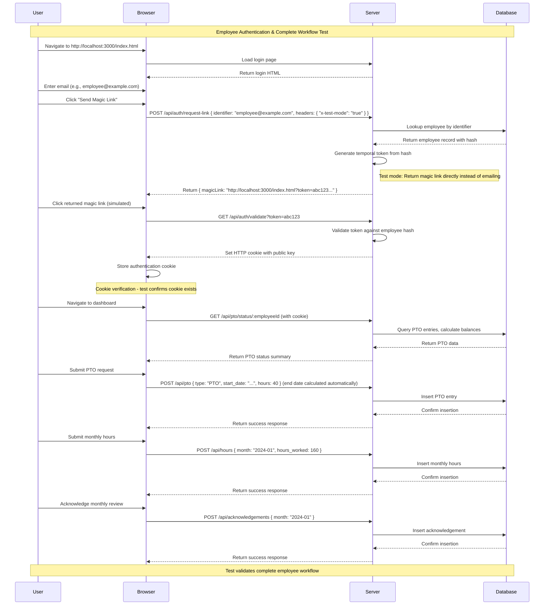

# DWP Hours Tracker

A Node.js application for tracking monthly hours worked and managing Paid Time Off (PTO) for employees. This project migrates from a legacy Excel spreadsheet system to a modern web application with a user-friendly interface and API.

**📋 Migration Reference**: For detailed information about the legacy Excel spreadsheet structure, see [`.github/skills/pto-spreadsheet-layout/SKILL.md`](.github/skills/pto-spreadsheet-layout/SKILL.md).

## Description

This application allows employees to log various types of time off (Sick, PTO, Bereavement, Jury Duty) for specific date ranges, including total hours. Users can view their PTO status for the entire year, broken down by month. An admin panel provides oversight for managing users and reviewing PTO usage.

**PTO Calculation Rules:**
- At the start of each year, the system automatically debits PTO entries with **96 hours of "PTO"** and **24 hours of "Sick"** dated January 1st
- PTO carryover from the prior year is added as an additional PTO entry on January 1st
- "Sick" time is **reset to 24 hours at the start of each year** (no carryover for sick time)
- In addition, employees **accrue pto_rate hours per work day** to their PTO balance throughout the year
- **Work days** are the total non-weekend (Monday-Friday) days in each month
- **Monthly accrual** = pto_rate × work_days_in_month
- **Available PTO** = Sum of allocation entries + Accrued - Used PTO Hours
- **Time Off Types**: "Sick", "PTO", "Bereavement", "Jury Duty" are all tracked as separate PTO types
- Each type has its own balance and usage tracking
- At year-end, usage reports must break down hours by type

The system ensures accurate tracking per employee with individual rates and carryover balances.

## Screenshots

### PTO Submission Form


*Submit time off requests by selecting a start date and total hours. The system automatically calculates the end date based on workdays.*

### Admin Panel Components

#### Admin Panel Overview


#### Employee Management


#### PTO Request Queue


#### Data Tables


#### Report Generation


#### Confirmation Dialogs


## Features

- **Secure Authentication**: Passwordless magic link authentication system
  - Email-based login with secure temporal tokens
  - No passwords required - enhanced security and user experience
- **Time Off Logging**: Submit time off entries via web UI or API
  - Types: Sick, PTO, Bereavement, Jury Duty
  - Select start date and total hours, with automatic calculation of the date range covering the specified number of workdays
- **PTO Status Dashboard**: View annual PTO status by month
   - **Monthly Accrual Breakdown UI**: Rendered as a two-column grid (month name on the left, hours on the right). Each row includes a clickable Calendar icon that reveals a month view. The month view uses legacy color coding for PTO types as documented in [`.github/skills/pto-spreadsheet-layout/SKILL.md`](.github/skills/pto-spreadsheet-layout/SKILL.md), and each day cell shows the number of hours in the bottom-right corner.
   - **Sick/Bereavement/Jury Duty Detail**: Each of these cards must list the specific dates taken and the hours for each date, not just the totals.
   - **PTO Section Cards**: Each `pto-section` is a dedicated web component derived from a shared base card component (one component per PTO aspect: Regular PTO, Monthly Accruals, Sick Time, Bereavement, Jury Duty, Employee Info). This keeps dashboard rendering consistent and testable.
- **Monthly Hours Review**: Submit and review monthly hours worked
- **Acknowledgement System**: Monthly acknowledgement of hours review completion
  - Automatic reminders at month-end
  - Daily follow-up reminders for unacknowledged reviews
  - Track acknowledgement status per employee per month
- **Employee Management**: Admin panel for adding/editing employee data
- **PTO Review**: Admin tools for reviewing monthly/yearly PTO usage with comprehensive reporting
- **Admin Dashboard**: Complete admin interface with navigation between different management views
- **Data Tables**: Sortable, paginated tables for displaying employee and PTO data
- **Form Validation**: Comprehensive validation for all admin forms
- **Confirmation Dialogs**: Modal dialogs for destructive actions
- **Report Generation**: Detailed PTO usage reports with filtering and export capabilities
- **API Integration**: RESTful API for programmatic access
- **Responsive Design**: Vanilla CSS for clean, accessible UI

## Architecture

- **Frontend**: Vanilla HTML, CSS, and TypeScript
- **Backend**: Node.js with TypeORM and SQLite database
- **Development Server**: http-serve for local development
- **Database**: SQLite with TypeORM entities for:
  - `Employee`: Employee information and authentication
  - `PtoEntry`: Time off tracking with relationships
  - `MonthlyHours`: Monthly hours worked submissions
  - `Acknowledgement`: Monthly review acknowledgements
- **ORM**: TypeORM with DataMapper pattern and sql.js driver for WSL compatibility
- **Automated Systems**: Monthly reminder scheduler and daily follow-up system

## Getting Started

### Prerequisites

- Node.js (v16 or higher)
- npm or yarn

### Quick Start

1. **Clone and Install**

   ```bash
   git clone <repository-url>
   cd dwp-hours-tracker
   npm install
   ```

2. **Set up the Database**

   ```bash
   npm run db:init
   ```

3. **Configure Email (Magic Link)**

   Copy `.env.example` to `.env` and set SMTP credentials used to send magic links:

   ```bash
   SMTP_HOST=your-smtp-host
   SMTP_PORT=587
   SMTP_USER=your-smtp-username
   SMTP_PASS=your-smtp-password
   SENDER_NAME=Your App Name
   SENDER_EMAIL=sender@example.com
   ```

4. **Start Development Server**

   ```bash
   npm run dev
   ```

4. **Open in Browser**

   Navigate to `http://localhost:3000` to access the application.

### Development Workflow

- **Build**: `npm run build` - Compile TypeScript to JavaScript
- **Lint**: `npm run lint` - Check TypeScript for errors
- **Format**: `npm run format` - Format code with Prettier
- **Test**: `npm test` - Run unit tests with Vitest
- **E2E Test**: `npm run test:e2e` - Run end-to-end tests with Playwright (9 tests passing covering admin panel components and employee workflow)

### Project Structure

```
dwp-hours-tracker/
├── client/              # Client-side source code
│   ├── app.ts          # Main client entry point
│   ├── index.html      # HTML template
│   ├── styles.css      # Styles
│   └── components/     # Web components for admin panel
│       ├── index.ts    # Master component exports
│       ├── test.ts     # Playground functions for testing
│       ├── admin-panel/
│       │   ├── index.ts      # Main admin panel container
│       │   ├── test.html     # Component test page
│       │   └── test.ts       # Component playground
│       ├── employee-list/
│       │   ├── index.ts      # Employee list component
│       │   ├── test.html     # Component test page
│       │   └── test.ts       # Component playground
│       ├── employee-form/
│       │   ├── index.ts      # Employee form component
│       │   ├── test.html     # Component test page
│       │   └── test.ts       # Component playground
│       ├── pto-request-queue/
│       │   ├── index.ts      # PTO request queue component
│       │   ├── test.html     # Component test page
│       │   └── test.ts       # Component playground
│       ├── data-table/
│       │   ├── index.ts      # Reusable data table component
│       │   ├── test.html     # Component test page
│       │   └── test.ts       # Component playground
│       ├── confirmation-dialog/
│       │   ├── index.ts      # Confirmation dialog component
│       │   ├── test.html     # Component test page
│       │   └── test.ts       # Component playground
│       ├── report-generator/
│       │   ├── index.ts      # Report generator component
│       │   ├── test.html     # Component test page
│       │   └── test.ts       # Component playground
│       └── ...               # Other component folders
├── src/                # Server-side source code
│   ├── server.mts      # Main server entry point
│   ├── entities/       # Server entities
│   └── ...             # Other server files
├── public/             # Built client assets (served by dev server)
│   ├── app.js          # Bundled client code
│   ├── index.html      # Copied HTML
│   └── styles.css      # Copied styles
├── dist/               # Built server assets
│   └── server.mjs      # Bundled server code
├── db/                 # Database files and schema
├── scripts/            # Utility scripts
├── docs/               # Documentation
├── logs/               # Application logs
├── package.json        # Project configuration
├── tsconfig.json       # TypeScript configuration
└── README.md           # This file
```

## Installation

## Usage

### For Employees

1. Enter your employee identifier (email address) to receive a magic link
2. Check your email and click the secure login link
3. Navigate to the dashboard to view your PTO status
4. Submit time off requests by selecting a start date, total hours, and type (the system automatically calculates the end date based on workdays)
5. Submit monthly hours worked at the end of each month
6. Review and acknowledge your monthly hours worked and PTO usage breakdown by category (PTO, Sick, Bereavement, Jury Duty)
7. Receive reminders if acknowledgement is pending

### For Admins

1. Access the admin panel (if you have admin role)
2. **Employee Management**: Add, edit, and manage employee records with comprehensive forms
3. **PTO Request Review**: Review pending PTO requests with approve/reject functionality and confirmation dialogs
4. **Data Tables**: View sortable, paginated tables of employees and PTO data
5. **Report Generation**: Generate detailed PTO usage reports with date filtering and CSV export
6. **Dashboard Navigation**: Switch between different admin views (employees, PTO requests, reports)

## Authentication System

The application uses a secure magic link authentication system that eliminates the need for passwords:

### Authentication Flow

1. **Request Magic Link**
   - Employee enters their identifier (email address) on the login page
   - System looks up the employee by identifier in the `employees` table
   - Generates a temporal token using the employee's stored hash
   - Sends an email containing a secure link with the token

2. **Token Validation**
   - Employee clicks the magic link in their email
   - Link contains a URL parameter with the temporal token
   - Browser makes a `GET /api/auth/validate` request with the token
   - Server validates the token against the employee's hash
   - If valid, server responds with a public key written to an HTTP cookie

3. **Authenticated Access**
   - Browser now has the authentication cookie
   - All subsequent API requests include this cookie
   - Server validates the cookie for protected endpoints
   - Employee gains access to their personal data and PTO management features

### Security Details

- **Temporal Tokens**: Short-lived tokens (typically expire in 15-30 minutes)
- **Hash-Based**: Tokens are generated from employee-specific hashes stored in the database
- **Cookie-Based**: Authentication state maintained via secure HTTP cookies
- **No Passwords**: Eliminates password-related security risks

### API Endpoints

**Note: The following endpoints are actually implemented in the current codebase. Previous documentation listed some endpoints that do not exist or have different paths.**

### PTO Management
- `GET /api/pto`: Retrieve all PTO entries (admin) or filtered entries
- `POST /api/pto`: Submit a new PTO entry by providing start date, total hours, and type (end date is automatically calculated based on workdays)
- `PUT /api/pto/:id`: Update an existing PTO entry (admin only)
- `DELETE /api/pto/:id`: Delete/cancel a PTO entry (admin only)
- `GET /api/pto/status/:employeeId`: Get comprehensive PTO status summary including balances, accruals, and usage by type

### Monthly Hours Tracking
- `POST /api/hours`: Submit monthly hours worked for an employee
- `GET /api/hours/:employeeId`: Retrieve monthly hours submissions for an employee

### Monthly Summary
- `GET /api/monthly-summary/:employeeId/:month`: Get monthly hours worked and PTO usage breakdown by category for acknowledgement review

### Acknowledgement System
- `POST /api/acknowledgements`: Submit monthly review acknowledgement of hours worked and PTO usage breakdown by category
- `GET /api/acknowledgements/:employeeId`: Check acknowledgement status for an employee
- `POST /api/admin-acknowledgements`: Submit admin review acknowledgement of employee's monthly hours and PTO usage breakdown by category (admin only)
- `GET /api/admin-acknowledgements/:employeeId`: Retrieve admin acknowledgements for an employee (admin only)

### Employee Management (Admin Only)
- `GET /api/employees`: List all employees with optional search/filtering
- `GET /api/employees/:id`: Get detailed information for a specific employee
- `PUT /api/employees/:id`: Update employee information (name, PTO rate, carryover, etc.)
- `DELETE /api/employees/:id`: Remove an employee from the system

**Missing from documentation but needed for full functionality:**
- `POST /api/employees`: Add a new employee (currently missing)
- `GET /api/employees/:id/pto-report`: Generate detailed PTO usage report (currently missing)
- `GET /api/reminders/unacknowledged`: Get list of employees needing monthly reminders (currently missing)

## TypeORM Entities

The database schema is defined using TypeORM entities with relationships and decorators. The entities are located in `src/entities/` and automatically generate the SQLite tables.

### Employee Entity

```typescript
@Entity("employees")
export class Employee {
  @PrimaryGeneratedColumn()
  id!: number;

  @Column({ type: "text" })
  name!: string;

  @Column({ type: "text", unique: true })
  identifier!: string;

  @Column({ type: "real", default: 0.71 })
  pto_rate!: number;  // Hours per work day for accrual calculations

  @Column({ type: "real", default: 0 })
  carryover_hours!: number;

  @Column({ type: "date" })
  hire_date!: Date;

  @Column({ type: "text", default: "Employee" })
  role!: string;

  @Column({ type: "text", nullable: true })
  hash!: string;

  @OneToMany(() => PtoEntry, ptoEntry => ptoEntry.employee)
  ptoEntries!: PtoEntry[];

  @OneToMany(() => MonthlyHours, monthlyHours => monthlyHours.employee)
  monthlyHours!: MonthlyHours[];

  @OneToMany(() => Acknowledgement, acknowledgement => acknowledgement.employee)
  acknowledgements!: Acknowledgement[];
}
```

### PtoEntry Entity

```typescript
@Entity("pto_entries")
export class PtoEntry {
  @PrimaryGeneratedColumn()
  id!: number;

  @Column({ type: "integer" })
  employee_id!: number;

  @Column({ type: "date" })
  start_date!: Date;

  @Column({ type: "date" })
  end_date!: Date;

  @Column({ type: "text" })
  type!: "Sick" | "PTO" | "Bereavement" | "Jury Duty";

  @Column({ type: "real" })
  hours!: number;

  @Column({ type: "datetime", default: () => "CURRENT_TIMESTAMP" })
  created_at!: Date;

  @ManyToOne(() => Employee, employee => employee.ptoEntries)
  @JoinColumn({ name: "employee_id" })
  employee!: Employee;
}
```

### MonthlyHours Entity

```typescript
@Entity("monthly_hours")
export class MonthlyHours {
  @PrimaryGeneratedColumn()
  id!: number;

  @Column({ type: "integer" })
  employee_id!: number;

  @Column({ type: "date" })
  month!: Date;

  @Column({ type: "real" })
  hours_worked!: number;

  @Column({ type: "datetime", default: () => "CURRENT_TIMESTAMP" })
  submitted_at!: Date;

  @ManyToOne(() => Employee, employee => employee.monthlyHours)
  @JoinColumn({ name: "employee_id" })
  employee!: Employee;
}
```

### Acknowledgement Entity

```typescript
@Entity("acknowledgements")
export class Acknowledgement {
  @PrimaryGeneratedColumn()
  id!: number;

  @Column({ type: "integer" })
  employee_id!: number;

  @Column({ type: "date" })
  month!: Date;

  @Column({ type: "datetime", default: () => "CURRENT_TIMESTAMP" })
  acknowledged_at!: Date;

  @ManyToOne(() => Employee, employee => employee.acknowledgements)
  @JoinColumn({ name: "employee_id" })
  employee!: Employee;
}
```

### AdminAcknowledgement Entity

```typescript
@Entity("admin_acknowledgements")
export class AdminAcknowledgement {
  @PrimaryGeneratedColumn()
  id!: number;

  @Column({ type: "integer" })
  employee_id!: number;

  @Column({ type: "date" })
  month!: Date;

  @Column({ type: "integer" })
  admin_id!: number;

  @Column({ type: "datetime", default: () => "CURRENT_TIMESTAMP" })
  acknowledged_at!: Date;

  @ManyToOne(() => Employee, employee => employee.acknowledgedByAdmins)
  @JoinColumn({ name: "employee_id" })
  employee!: Employee;

  @ManyToOne(() => Employee, employee => employee.adminAcknowledgements)
  @JoinColumn({ name: "admin_id" })
  admin!: Employee;
}
```

## Admin Panel

**Status: Fully Implemented** - Complete web components implementation with comprehensive E2E testing.

Currently provides:
- **Employee Management**: Add, edit, and manage employee records
- **PTO Request Queue**: Review and approve/reject PTO requests with confirmation dialogs
- **Data Tables**: Sortable, paginated tables for displaying employee and PTO data
- **Report Generation**: Monthly/yearly PTO usage reports with filtering and CSV export
- **Form Validation**: Comprehensive validation for employee data entry
- **Component Architecture**: Modular web components with Shadow DOM encapsulation
- **E2E Testing**: 8 comprehensive Playwright tests covering all functionality

Access requires admin privileges.

## Web Components Summary

- **admin-panel**: Container for admin-only views and navigation between employee management, PTO requests, and reports.
- **confirmation-dialog**: Modal dialog for confirm/cancel actions used across destructive workflows.
- **data-table**: Reusable, sortable, paginated table component for employee and PTO datasets.
- **employee-form**: Form UI for creating and editing employees (name, identifier, PTO rate, carryover, hire date, role).
- **employee-list**: List/table view of employees with edit/delete actions.
- **pto-calendar**: Calendar component for displaying PTO entries with color-coded days and legend.
- **pto-request-queue**: Queue view for reviewing submitted PTO requests with approve/reject actions.
- **report-generator**: Report UI for PTO usage summaries with filters and export controls.
- **pto-summary-card**: Regular PTO balances (allocation, available, used, carryover).
- **pto-accrual-card**: Monthly accrual breakdown grid with calendar drill-down and legacy PTO color coding.
- **pto-sick-card**: Sick time allowance, used, remaining, plus a list of dates and hours for each sick entry.
- **pto-bereavement-card**: Bereavement allowance, used, remaining, plus a list of dates and hours for each bereavement entry.
- **pto-jury-duty-card**: Jury duty allowance, used, remaining, plus a list of dates and hours for each jury duty entry.
- **pto-employee-info-card**: Hire date, next rollover, and related metadata.

All PTO dashboard cards share a common base class for consistent layout and styling.

## End-to-End Testing Strategy

**Status: Implemented** - Comprehensive E2E testing framework implemented with employee authentication and workflow validation. The test validates the complete user journey from login through dashboard access.

### Employee Authentication & Workflow E2E Test

**✅ IMPLEMENTED**: `e2e/employee-workflow.spec.ts` - Complete E2E test for employee authentication and basic workflow validation.

**Note**: E2E tests require the development server running on `http://localhost:3000`. Run `npm run dev` in a separate terminal before executing E2E tests.

The primary E2E test simulates a complete employee experience, starting from login through dashboard access. This test validates the magic link authentication flow and ensures the core employee journey works end-to-end.

#### Test Flow Overview



#### Key Testing Features

**Authentication Testing:**
- Magic link generation and validation
- Cookie-based session management
- Secure token handling

**Workflow Validation:**
- PTO status dashboard access
- Time off request submission
- Monthly hours reporting
- Acknowledgement system
- Data persistence and retrieval

**Testing Infrastructure:**
- **Magic Link Bypass**: For E2E testing, the `/api/auth/request-link` endpoint returns the magic link URL directly instead of sending an email. This allows automated tests to access the link programmatically.
- **Cookie Verification**: Tests confirm that authentication cookies are properly set and maintained.
- **State Management**: Each test run uses isolated database state to prevent interference.

#### Future Test Extensions

The employee authentication test serves as a foundation for comprehensive workflow testing:

1. **Admin Workflow Tests**: Parallel E2E tests covering admin panel functionality
2. **Multi-User Scenarios**: Tests with multiple employees and admins interacting
3. **Edge Case Testing**: Invalid tokens, expired sessions, permission boundaries
4. **Performance Testing**: Load testing with multiple concurrent users
5. **Cross-Browser Testing**: Validation across different browser environments

#### Implementation Notes

- Tests run against `http://localhost:3000` with the development server
- Database is seeded with test data before each test run
- Authentication bypass is clearly marked as testing-only functionality
- Production deployment will use proper email delivery for magic links
- **Test Mode**: Server detects test mode via `x-test-mode: true` header or `NODE_ENV=test`
- **Magic Link Return**: In test mode, `/api/auth/request-link` returns the magic link URL directly for automated testing
- **Test File**: `e2e/employee-workflow.spec.ts` implements the complete employee authentication and workflow test

## Monthly Review & Acknowledgement System

**Status: Partially Implemented** - Basic acknowledgement functionality exists for both employees and admins, but automated reminders are not yet implemented.

Currently provides:
- Manual submission of monthly acknowledgements via API (employee and admin), including review of hours worked and PTO usage breakdown by category (PTO, Sick, Bereavement, Jury Duty)
- Tracking of acknowledgement timestamps for both types
- Basic acknowledgement status checking
- Admin panel integration for admin acknowledgments

**Planned automated features (not yet implemented):**
- Automatic reminders at month-end
- Daily follow-up reminders for unacknowledged reviews
- Automated reminder scheduler system

### Acknowledgement Process

- Employees can manually submit acknowledgements via the API after reviewing their monthly hours worked and PTO usage breakdown by category
- Admins can acknowledge employee submissions after reviewing the same breakdown
- The system tracks acknowledgement timestamps
- **Automated reminders are planned but not yet implemented**

### Reminder Workflow

**Current state:** Manual acknowledgement only
**Planned:** Automated monthly and daily reminder system

## Similar Projects/Solutions

Here are some similar open-source projects and commercial solutions that can serve as inspiration:

1. **Time Off Management Systems**:
   - [OrangeHRM](https://www.orangehrm.com/): Open-source HR management with time off tracking
   - [Sentrifugo](https://www.sentrifugo.com/): HRMS with leave management

2. **Time Tracking Applications**:
   - [Kimai](https://www.kimai.org/): Open-source time tracking software
   - [Toggl Track](https://toggl.com/track/): Commercial time tracking with PTO features

3. **PTO-Specific Trackers**:
   - [Vacation Tracker](https://github.com/vacationtracker): Open-source vacation tracking
   - [BambooHR](https://www.bamboohr.com/): Commercial HR platform with PTO management

4. **Node.js-Based HR Tools**:
   - [Node-RED HR Dashboard](https://nodered.org/): Customizable dashboard for HR metrics
   - [Express.js PTO API](https://github.com/expressjs/express): Framework for building similar APIs

These projects demonstrate various approaches to time off tracking, from simple spreadsheets to full HR suites.

## Contributing

1. Fork the repository
2. Create a feature branch
3. Make your changes
4. Add tests if applicable
5. Submit a pull request

## License

This project is licensed under the MIT License - see the LICENSE file for details.

## Migration from Legacy Spreadsheet

This application replaces the manual Excel spreadsheet tracking (see `legacy.spreadsheet.txt`) with an automated, database-driven system. The migration process involves:

- Importing existing employee data
- Converting spreadsheet entries to database records
- Setting up individual PTO rates and carryover balances
- Training users on the new interface

**📋 Migration Reference**: For detailed information about the legacy Excel spreadsheet structure, see [`.github/skills/pto-spreadsheet-layout/SKILL.md`](.github/skills/pto-spreadsheet-layout/SKILL.md) which provides comprehensive documentation of all spreadsheet sections, data layouts, and extraction patterns.
