# DWP Hours Tracker

A Node.js application for tracking monthly hours worked and managing Paid Time Off (PTO) for employees. This project migrates from a legacy Excel spreadsheet system to a modern web application with a user-friendly interface and API.

**📋 Migration Reference**: For detailed information about the legacy Excel spreadsheet structure, see [`.github/skills/pto-spreadsheet-layout/SKILL.md`](.github/skills/pto-spreadsheet-layout/SKILL.md).

## Description

This application allows employees to log various types of time off (Sick, PTO, Bereavement, Jury Duty) for specific date ranges, including total hours. Users can view their PTO status for the entire year, broken down by month. An admin panel provides oversight for managing users and reviewing PTO usage.

**📋 PTO Calculation Rules**: For detailed information about PTO business logic, calculations, and rules, see [`.github/skills/pto-calculation-rules-assistant/SKILL.md`](.github/skills/pto-calculation-rules-assistant/SKILL.md).

The system ensures accurate tracking per employee with individual rates and carryover balances.

## Screenshots

### PTO Submission Form

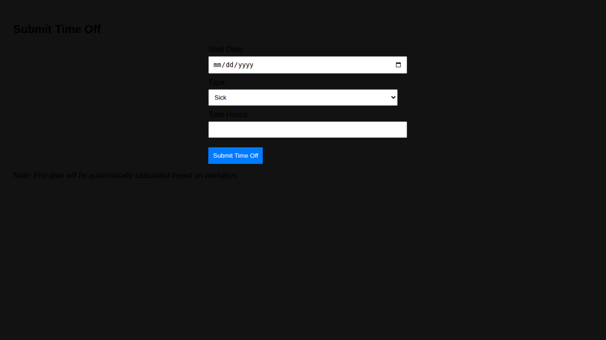

_Submit time off requests by selecting a start date and total hours. The system automatically calculates the end date based on workdays._

### Admin Panel Components

#### Admin Panel Overview

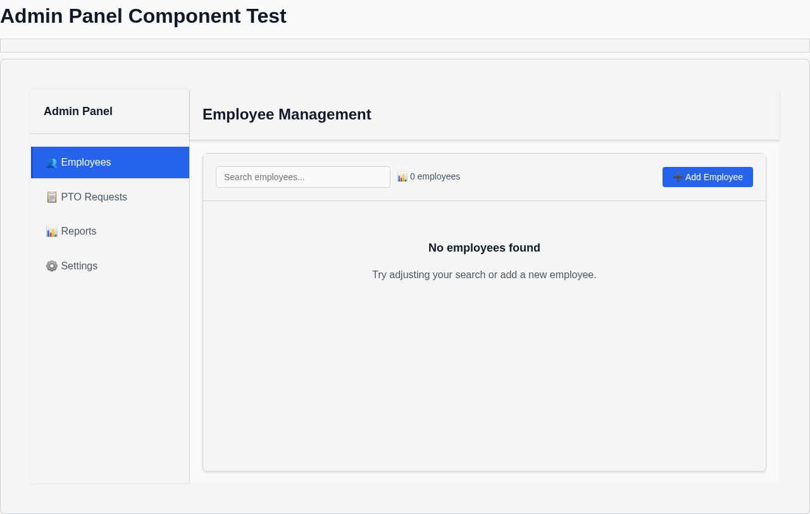

#### Employee Management

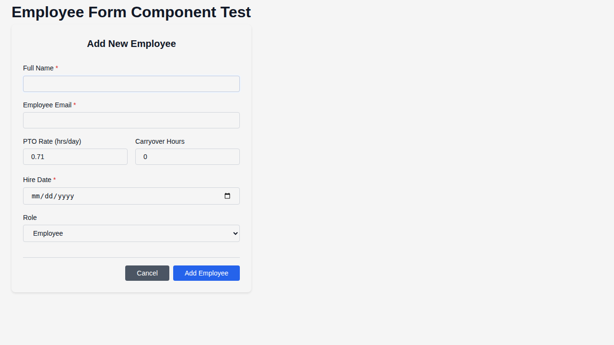
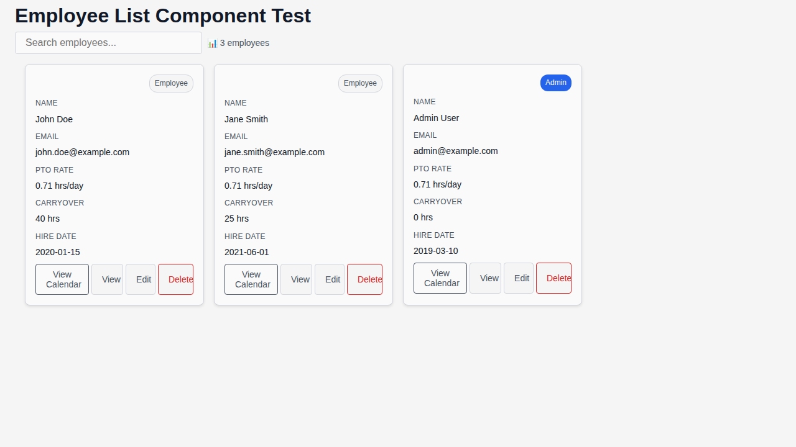

#### PTO Request Queue

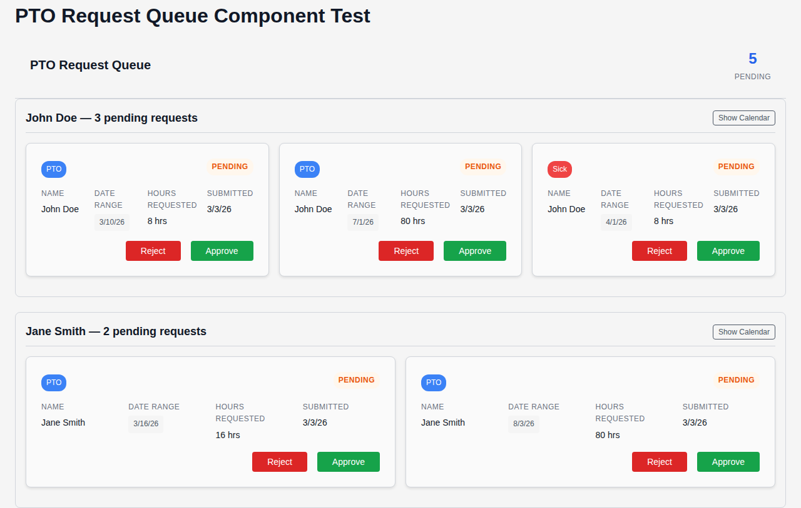

#### Data Tables

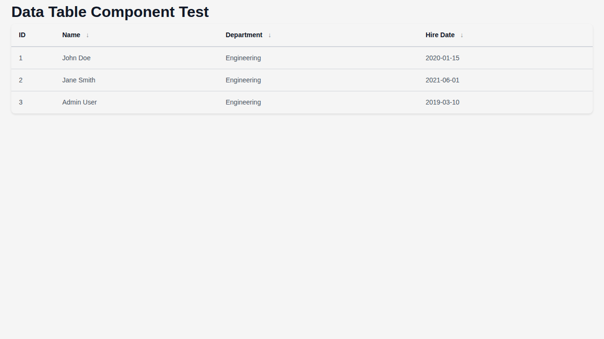

#### Report Generation

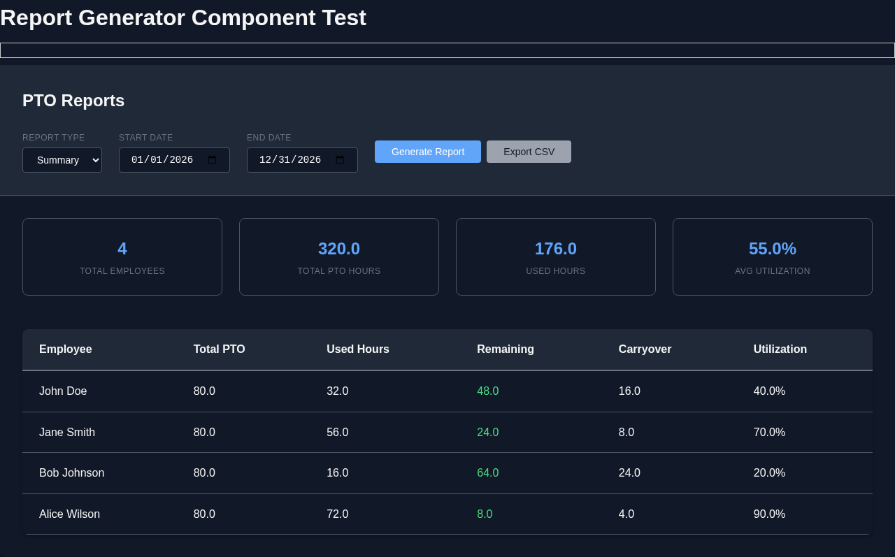

#### Confirmation Dialogs

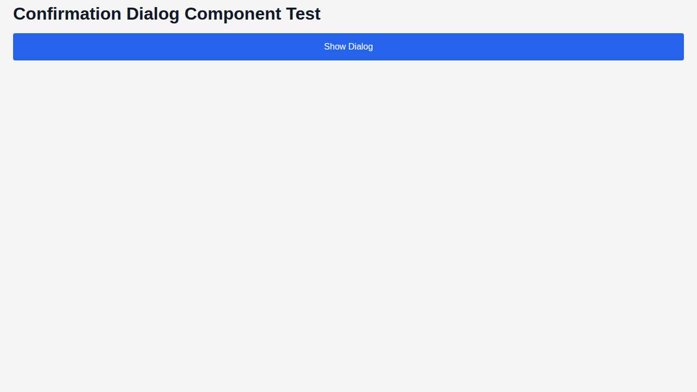

### PTO Dashboard Components

#### PTO Summary Card

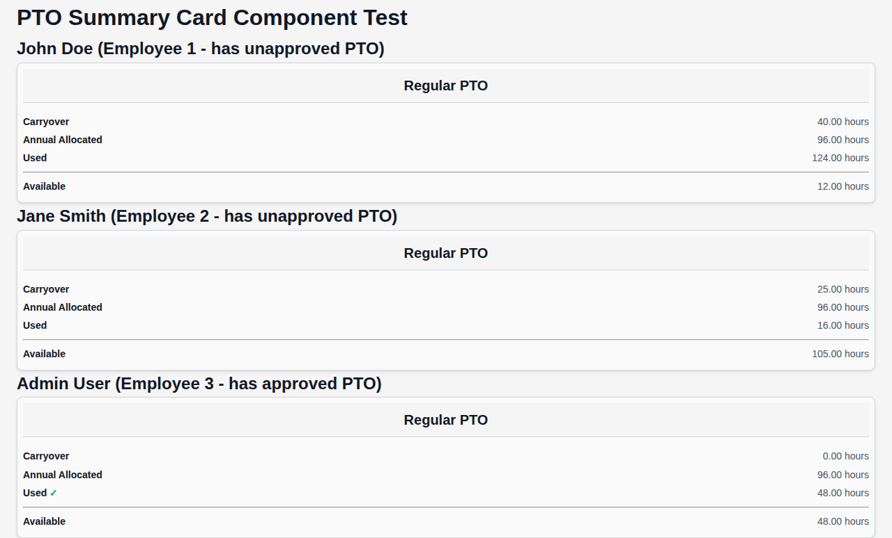

_Displays overall PTO allocation and usage summary._

#### PTO Accrual Card


_Shows monthly PTO accruals with interactive calendar views for detailed usage._

#### PTO Sick Card

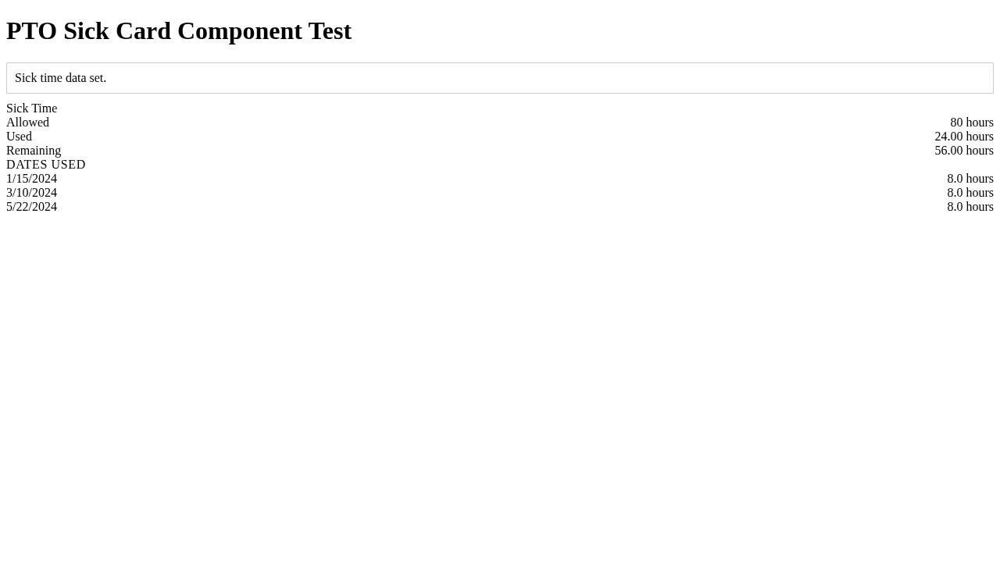

_Tracks sick time allocation, usage, and remaining balance._

#### PTO Bereavement Card

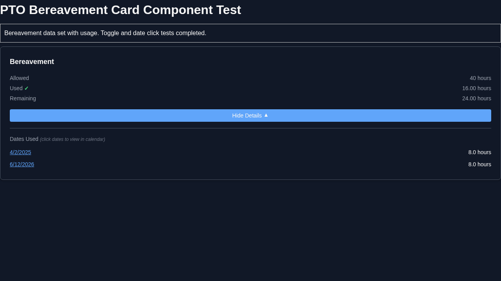

_Manages bereavement time with date-specific entries._

#### PTO Jury Duty Card

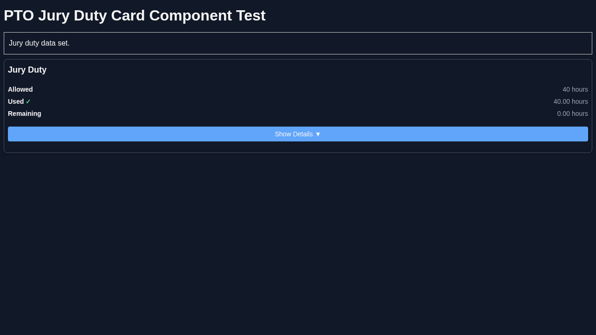

_Handles jury duty time tracking and reporting._

#### PTO Employee Info Card

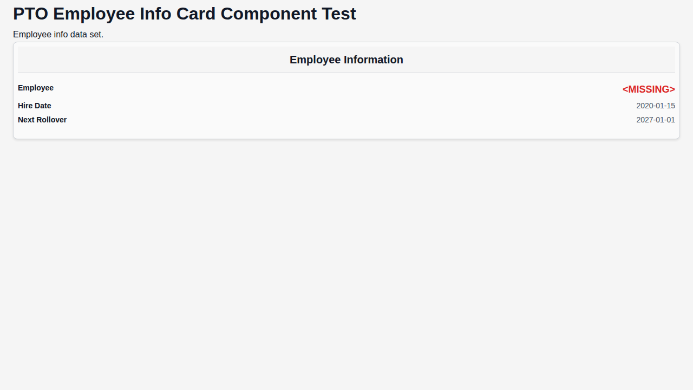

_Displays employee information and PTO rate details._

## Features

- **Secure Authentication**: Passwordless magic link authentication system
  - Email-based login with secure temporal tokens
  - No passwords required - enhanced security and user experience
- **Time Off Logging**: Submit time off entries via web UI or API
  - Types: Sick, PTO, Bereavement, Jury Duty
  - Select start date and total hours, with automatic calculation of the date range covering the specified number of workdays
- **PTO Status Dashboard**: View annual PTO status by month
  - **Monthly Accrual Breakdown UI**: Rendered as a two-column grid (month name on the left, hours on the right). Each row includes a clickable Calendar icon that reveals a month view. The month view uses legacy color coding for PTO types as documented in [`.github/skills/pto-spreadsheet-layout/SKILL.md`](.github/skills/pto-spreadsheet-layout/SKILL.md), and each day cell shows the number of hours in the bottom-right corner.
  - **Sick/Bereavement/Jury Duty Detail**: Each of these cards must list the specific dates taken and the hours for each date, not just the totals.
  - **PTO Section Cards**: Each `pto-section` is a dedicated web component derived from a shared base card component (one component per PTO aspect: Regular PTO, Monthly Accruals, Sick Time, Bereavement, Jury Duty, Employee Info). This keeps dashboard rendering consistent and testable.
- **Prior Year Review**: Users can review PTO data from previous years
  - Render all twelve months (January → December) in a grid layout for the prior year
  - Dedicated web component integrated into the main dashboard
  - Shows PTO usage, accruals, and balances for historical review
  - Self-contained component with external year selection for flexible dashboard integration
- **Monthly Hours Review**: Submit and review monthly hours worked
- **Acknowledgement System**: Monthly acknowledgement of hours review completion
  - Automatic reminders at month-end
  - Daily follow-up reminders for unacknowledged reviews
  - Track acknowledgement status per employee per month
- **Employee Management**: Admin panel for adding/editing employee data
- **PTO Review**: Admin tools for reviewing monthly/yearly PTO usage with comprehensive reporting
- **Admin Dashboard**: Complete admin interface with navigation between different management views
- **Data Tables**: Sortable, paginated tables for displaying employee and PTO data
- **Form Validation**: Comprehensive validation for all admin forms
- **Confirmation Dialogs**: Modal dialogs for destructive actions
- **Report Generation**: Detailed PTO usage reports with filtering and export capabilities
- **API Integration**: RESTful API for programmatic access
- **Responsive Design**: Vanilla CSS for clean, accessible UI

**📋 Architecture**: For detailed information about the system architecture, tech stack, and design patterns, see [`.github/skills/architecture-guidance/SKILL.md`](.github/skills/architecture-guidance/SKILL.md).

**📋 Date Management**: For detailed information about the date handling system and YYYY-MM-DD patterns, see [`.github/skills/date-management-assistant/SKILL.md`](.github/skills/date-management-assistant/SKILL.md).

**📋 DOM Utilities**: For detailed information about the DOM manipulation utilities and type-safe element queries, see [`.github/skills/dom-utilities-assistant/SKILL.md`](.github/skills/dom-utilities-assistant/SKILL.md).

**📋 Prior Year Review Component**: For detailed information about the historical PTO visualization component, see [`client/components/prior-year-review/README.md`](client/components/prior-year-review/README.md).

**📋 Notification System**: For detailed information about the toast notification system and user feedback patterns, see [`.github/skills/notification-system-assistant/SKILL.md`](.github/skills/notification-system-assistant/SKILL.md).

## Theming System

This project implements a comprehensive theming system using vanilla CSS that provides both light and dark theme support, automatically honoring the user's system preferences. The application seamlessly adapts to the operating system's color scheme settings without requiring manual theme selection.

**Theme Behavior:**

- **System Preference Detection**: Uses CSS `prefers-color-scheme` media query to detect the user's system theme setting
- **Automatic Switching**:
  - If system is set to dark mode → Uses dark theme
  - If system is set to light mode → Uses light theme
  - If no system preference is set → Defaults to light theme
- **Real-time Updates**: Themes switch automatically when the user changes their system theme settings

**Implementation Details:**

- **Semantic Color Naming**: Colors are named by their semantic purpose (e.g., `--color-primary`, `--color-error`) rather than appearance (e.g., `--color-blue`, `--color-red`), following CSS-Tricks best practices for maintainable theming
- **CSS Custom Properties Structure**: Theme variables are organized hierarchically:
  - **Base Colors**: Raw color values (e.g., `--color-gray-100: #f5f5f5`)
  - **Semantic Mappings**: Purpose-based color assignments (e.g., `--color-primary: var(--color-blue-500)`)
  - **Theme Overrides**: Light/dark specific adjustments using `@media (prefers-color-scheme: dark)`
- **Media Query Integration**: `@media (prefers-color-scheme: dark)` queries apply dark theme styles automatically
- **Fallback Support**: Light theme serves as the default fallback when no preference is detected
- **Accessibility**: All themes maintain proper contrast ratios and accessibility standards
- **Performance**: Zero JavaScript overhead - theming is handled entirely through CSS

**CSS Structure Example:**

```css
:root {
  /* Base color palette */
  --color-gray-50: #fafafa;
  --color-gray-100: #f5f5f5;
  --color-blue-500: #3b82f6;
  --color-red-500: #ef4444;

  /* Semantic color mappings */
  --color-primary: var(--color-blue-500);
  --color-error: var(--color-red-500);
  --color-background: var(--color-gray-50);
  --color-surface: var(--color-gray-100);
  --color-text: #1f2937;
}

/* Dark theme overrides */
@media (prefers-color-scheme: dark) {
  :root {
    --color-background: #1f2937;
    --color-surface: #374151;
    --color-text: #f9fafb;
  }
}
```

**Key Features:**

- **Seamless Integration**: No theme toggle buttons or manual selection required
- **Consistent Experience**: All components and UI elements adapt automatically
- **Battery Friendly**: Respects system settings that may optimize for battery life in dark mode
- **Cross-Platform**: Works consistently across different operating systems and browsers
- **Maintainable**: Semantic naming and hierarchical structure make theme updates easy

**Component Adaptation Plan:**
Each web component must be updated to use semantic CSS custom properties instead of hardcoded colors. The following plan outlines the theming adaptation for each component:

- **admin-panel**: Update navigation background, borders, and text colors to use `--color-surface`, `--color-primary`, and `--color-text`
- **confirmation-dialog**: ✅ Adapted modal background, button colors, and text to use `--color-surface`, `--color-primary`, `--color-error`, and `--color-text`
- **data-table**: ✅ Adapted table headers, rows, borders, and hover states to use `--color-surface`, `--color-text`, and `--color-primary` variants
- **employee-form**: ✅ Adapted form inputs, labels, borders, and validation states to use `--color-surface`, `--color-text`, `--color-primary`, and `--color-error`
- **employee-list**: Update list items, action buttons, and status indicators to use `--color-surface`, `--color-text`, and `--color-primary`
- **pto-calendar**: Adapt calendar grid, day cells, and PTO type color coding to use `--color-surface`, `--color-text`, and semantic PTO colors
- **pto-request-queue**: Update request cards, status badges, and action buttons to use `--color-surface`, `--color-text`, `--color-primary`, and `--color-error`
- **report-generator**: Adapt filter controls, export buttons, and report tables to use `--color-surface`, `--color-text`, and `--color-primary`
- **pto-summary-card**: Update card background, text, and accent colors to use `--color-surface`, `--color-text`, and `--color-primary`
- **pto-accrual-card**: Adapt grid layout, calendar icons, and accrual indicators to use `--color-surface`, `--color-text`, and `--color-primary`
- **pto-sick-card**: Update card styling and date/hour list formatting to use `--color-surface`, `--color-text`, and `--color-error` for sick-specific theming
- **pto-bereavement-card**: Adapt card background and bereavement entry styling to use `--color-surface`, `--color-text`, and bereavement-specific semantic colors
- **pto-jury-duty-card**: Update card theming and jury duty entry formatting to use `--color-surface`, `--color-text`, and jury duty-specific colors
- **pto-employee-info-card**: Adapt info display and metadata styling to use `--color-surface`, `--color-text`, and `--color-primary`

**Implementation Steps:**

1. **Audit Current Styles**: Review each component's CSS for hardcoded colors and identify semantic replacements
2. **Define Missing Variables**: Add any component-specific semantic color variables to the theme system (e.g., `--color-pto-sick`, `--color-pto-bereavement`)
3. **Update Component Styles**: Replace hardcoded colors with CSS custom property references
4. **Test Theme Switching**: Verify all components adapt properly when system theme changes
5. **Validate Accessibility**: Ensure contrast ratios remain compliant in both light and dark themes

This approach ensures all components maintain visual consistency while automatically adapting to user theme preferences.

### Theming Tips for Consistency

Centralize values in a design system for maintainability. Use CSS variables on `:root` or a theme class.

#### 1. **Design Tokens**

- Define reusable tokens: e.g., `--font-size-base: 1rem; --border-width: 1px; --border-radius: 4px;`.
- Group by category: fonts, borders, spacing (e.g., `--space-xs: 4px; --space-md: 16px;` for scalable grids).
- Extend for themes: `--border-color: light-dark(#000, #fff);`.

#### 2. **Units and Scaling**

- Prefer `rem` for fonts/sizes (root-relative, accessible scaling).
- Use `em` for borders/radii within components (parent-relative).
- Avoid pixels; ensures responsiveness.

#### 3. **Naming and Structure**

- Consistent naming: Prefix with category (e.g., `--font-family-heading`, `--border-style-solid`).
- Modular files: Separate tokens.css from components.
- Use Sass/Less for maps/loops if complex (e.g., generate radius variants).

#### 4. **Enforcement**

- Linters: Stylelint rules to ban hard-coded values, enforce var() usage.
- Audits: Tools like Theo or Tokens Studio to validate tokens.
- JS integration: Theme provider in frameworks (e.g., React's ThemeContext) for dynamic swaps.

#### 5. **Best Practices**

- Inherit via `:host` in web components.
- Test: Visual regression tools (e.g., Percy) for consistency across modes/devices.
- Document: Style guide (e.g., Storybook) with token references.

This approach minimizes duplication, eases updates (change one var, propagates everywhere).

## Up Next

The following features are planned for upcoming development:

1. ✅ **COMPLETED**: Fix date handling regression - timezone issues causing PTO entries to shift dates. See ./TASKS/issue-date-handling-regression.md for details
2. ✅ **COMPLETED**: Complete PTO form enhancements - dynamic field behavior, validation, and calendar integration. See ./TASKS/pto-form-enhancements.md for details
3. LATER: Implement email delivery for magic link authentication. See ./TASKS/Email Magic Link.md for details
4. ✅ **COMPLETED**: Implement API type safety with shared models between client and server. See ./TASKS/api-type-safety.md for details
5. ✅ **COMPLETED**: Complete database reset/reload service for deterministic E2E testing. See ./TASKS/database-reset-reload-service.md for remaining items
6. ✅ **COMPLETED**: Complete PTO entry form calendar integration E2E tests. See ./TASKS/pto-entry-form-calendar-integration.md for Phase 4 items
7. ✅ **COMPLETED**: Complete CSS theming implementation - integration testing and documentation. See ./TASKS/css-theming-implementation.md for Phase 16-17 items
8. ✅ **COMPLETED**: Complete user data migration validation and documentation. See ./TASKS/user-data-migration-corey-alix.md for Phase 4 items
9. ✅ **COMPLETED**: Complete theming tips best practices implementation. See ./TASKS/theming-tips-consistency.md for Phase 5 items
10. LATER: See ./TASKS/deployment-automation.md for details on implementing automated deployment with Netlify

**📋 Development Best Practices and Learnings**: For detailed information about development best practices, testing strategies, and implementation learnings, see [`.github/skills/development-best-practices-assistant/SKILL.md`](.github/skills/development-best-practices-assistant/SKILL.md).
- **Real-time Updates**: Ensure UI updates immediately after successful operations to prevent user confusion.
- **Concurrent Submissions**: Consider race conditions in multi-user scenarios.
- **E2E Test Maintenance**: As test suites grow, focus on critical workflows and use database resets for state management.
- **Browser Compatibility**: Web component shadow DOM has excellent modern browser support but may need fallbacks for legacy browsers.

## Getting Started

### Prerequisites

- Node.js (v16 or higher)
- pnpm (recommended) or npm

### Quick Start

1. **Clone and Install**

   ```bash
   git clone <repository-url>
   cd dwp-hours-tracker
   pnpm install
   ```

2. **Set up the Database**

   ```bash
   pnpm run db:init
   ```

3. **Configure Email (Magic Link)**

   Copy `.env.example` to `.env` and set SMTP credentials used to send magic links:

   ```bash
   SMTP_HOST=your-smtp-host
   SMTP_PORT=587
   SMTP_USER=your-smtp-username
   SMTP_PASS=your-smtp-password
   SENDER_NAME=Your App Name
   SENDER_EMAIL=sender@example.com
   ```

4. **Start Development Server**

   ```bash
   pnpm run dev:external
   ```

5. **Open in Browser**

   Navigate to `http://localhost:3000` to access the application.

### Development Workflow

#### Core Development Commands
- **Start Development Server**: `pnpm run start` - Start development server with auto-restart on server file changes
- **Start Frontend Dev Server**: `pnpm run dev:external` - Start frontend development server (static file server) on PORT
- **Build**: `pnpm run build` - Compile TypeScript to JavaScript for both client and server
- **Lint**: `pnpm run lint` - Check TypeScript, CSS, and markdown for errors across all code
- **Format**: `pnpm run format` - Format code with Prettier

#### Testing Commands
- **Full Test Suite**: `pnpm test` - Run lint, build, seed database, unit tests, then E2E tests
- **Unit Tests**: `pnpm run test:unit` - Run unit tests with Vitest
- **E2E Tests**: `pnpm run test:e2e` - Run end-to-end tests with Playwright (includes lint, build, and database setup)
- **Date/Timezone Tests**: `pnpm run test:unit:date-fns:tz` - Run shared date-fns facade tests under multiple timezone values

#### Database Commands
- **Initialize Database**: `pnpm run db:init` - Initialize database (handled automatically by server startup)
- **Seed Database**: `pnpm run seed` - Run database seeding script with test data
- **Run Migrations**: `pnpm run migrate` - Run database migration script
- **Reload Database**: `pnpm run server:reload` - Reload the server's database from disk (useful during development)
- **Seed for E2E Tests**: `pnpm run playwright:seed` - Seed database and reload server for Playwright tests

#### API and Server Utilities
- **Get API Version**: `pnpm run api:version` - Get the current API version
- **Stop Server**: `pnpm run stop` - Kill development server process on port 3000

#### Production Deployment
- **Start Production**: `pnpm run start:prod` - Start production server from built dist/server.mjs
- **PM2 Start**: `pnpm run pm2:start` - Start app with PM2 process manager
- **PM2 Stop**: `pnpm run pm2:stop` - Stop app with PM2
- **PM2 Restart**: `pnpm run pm2:restart` - Restart app with PM2
- **PM2 Logs**: `pnpm run pm2:logs` - Show PM2 logs for the app

#### Worktree Development (Advanced)
- **Worktree Port**: `pnpm run worktree:port` - Show the port assigned to current worktree
- **Worktree Dev Server**: `pnpm run dev:worktree` - Start dev server with worktree-specific port

## CI/CD Pipeline

The project uses GitHub Actions for continuous integration and deployment with automated testing, quality checks, and deployment to Netlify.

### Pipeline Status

[](https://github.com/your-org/dwp-hours-tracker/actions/workflows/ci.yml)

### Workflow Overview

The CI/CD pipeline runs on every push to `main` branch and pull request:

1. **Quality Checks**: Linting, TypeScript compilation, and build verification
2. **Unit Tests**: Automated unit test execution with JUnit reporting
3. **E2E Tests**: Full end-to-end test suite with Playwright
4. **Test Reporting**: Detailed test results published to GitHub Actions UI
5. **Deployment**: Automatic deployment to Netlify on successful main branch builds

### Local Development Hooks

- **Pre-commit**: Runs full test suite on main branch, linting on feature branches
- **Pre-push**: Validates pushes to main with full test suite, allows fast iteration on feature branches

### Branch Protection

Branch protection rules require CI to pass before merging to main. Developers can bypass hooks using `--no-verify` flags for urgent fixes.

### Test Results

Test results are automatically published to:
- GitHub Actions UI with detailed pass/fail status
- Pull request comments with test summaries
- JUnit XML files for external tool integration

### Performance Monitoring

The pipeline includes performance monitoring through:
- Test execution timing validation (< 100ms for balance calculations)
- Build time tracking
- Test failure rate monitoring
- CI pipeline duration metrics (typically ~3-4 minutes for full pipeline)

### Troubleshooting

See [CI/CD Troubleshooting Guide](docs/ci-cd-troubleshooting.md) for common issues and solutions.

### Project Structure

```
dwp-hours-tracker/
├── client/              # Client-side source code
│   ├── app.ts          # Main client entry point
│   ├── index.html      # HTML template
│   ├── styles.css      # Styles
│   └── components/     # Web components for admin panel
│       ├── index.ts    # Master component exports
│       ├── test.ts     # Playground functions for testing
│       ├── admin-panel/
│       │   ├── index.ts      # Main admin panel container
│       │   ├── test.html     # Component test page
│       │   └── test.ts       # Component playground
│       ├── employee-list/
│       │   ├── index.ts      # Employee list component
│       │   ├── test.html     # Component test page
│       │   └── test.ts       # Component playground
│       ├── employee-form/
│       │   ├── index.ts      # Employee form component
│       │   ├── test.html     # Component test page
│       │   └── test.ts       # Component playground
│       ├── pto-request-queue/
│       │   ├── index.ts      # PTO request queue component
│       │   ├── test.html     # Component test page
│       │   └── test.ts       # Component playground
│       ├── data-table/
│       │   ├── index.ts      # Reusable data table component
│       │   ├── test.html     # Component test page
│       │   └── test.ts       # Component playground
│       ├── confirmation-dialog/
│       │   ├── index.ts      # Confirmation dialog component
│       │   ├── test.html     # Component test page
│       │   └── test.ts       # Component playground
│       ├── report-generator/
│       │   ├── index.ts      # Report generator component
│       │   ├── test.html     # Component test page
│       │   └── test.ts       # Component playground
│       └── ...               # Other component folders
├── server/                # Server-side source code
│   ├── server.mts      # Main server entry point
│   ├── entities/       # Server entities
│   └── ...             # Other server files
├── public/             # Built client assets (served by dev server)
│   ├── app.js          # Bundled client code
│   ├── index.html      # Copied HTML
│   └── styles.css      # Copied styles
├── dist/               # Built server assets
│   └── server.mjs      # Bundled server code
├── db/                 # Database files and schema
├── scripts/            # Utility scripts
├── docs/               # Documentation
├── logs/               # Application logs
├── package.json        # Project configuration
├── tsconfig.json       # TypeScript configuration
└── README.md           # This file
```

## Usage

### For Employees

1. Enter your employee identifier (email address) to receive a magic link
2. Check your email and click the secure login link
3. Navigate to the dashboard to view your PTO status
4. Submit time off requests by selecting a start date, total hours, and type (the system automatically calculates the end date based on workdays)
5. Submit monthly hours worked at the end of each month
6. Review and acknowledge your monthly hours worked and PTO usage breakdown by category (PTO, Sick, Bereavement, Jury Duty)
7. Receive reminders if acknowledgement is pending

### For Admins

1. Access the admin panel (if you have admin role)
2. **Employee Management**: Add, edit, and manage employee records with comprehensive forms
3. **PTO Request Review**: Review pending PTO requests with approve/reject functionality and confirmation dialogs
4. **Data Tables**: View sortable, paginated tables of employees and PTO data
5. **Report Generation**: Generate detailed PTO usage reports with date filtering and CSV export
6. **Dashboard Navigation**: Switch between different admin views (employees, PTO requests, reports)

## Authentication System

The application uses a secure magic link authentication system that eliminates the need for passwords:

### Authentication Flow

1. **Request Magic Link**
   - Employee enters their identifier (email address) on the login page
   - System looks up the employee by identifier in the `employees` table
   - Generates a temporal token using the employee's stored hash
   - Sends an email containing a secure link with the token

2. **Token Validation**
   - Employee clicks the magic link in their email
   - Link contains a URL parameter with the temporal token
   - Browser makes a `GET /api/auth/validate` request with the token
   - Server validates the token against the employee's hash
   - If valid, server responds with a public key written to an HTTP cookie

3. **Authenticated Access**
   - Browser now has the authentication cookie
   - All subsequent API requests include this cookie
   - Server validates the cookie for protected endpoints
   - Employee gains access to their personal data and PTO management features

### Security Details

- **Temporal Tokens**: Short-lived tokens (typically expire in 15-30 minutes)
- **Hash-Based**: Tokens are generated from employee-specific hashes stored in the database
- **Cookie-Based**: Authentication state maintained via secure HTTP cookies
- **No Passwords**: Eliminates password-related security risks

### Authentication

Most API endpoints require authentication. Authentication is handled via cookie-based sessions.

#### Authentication Flow

1. **Request Magic Link**: `POST /api/auth/request-link` with email identifier
2. **Validate Token**: Click magic link to validate token via `GET /api/auth/validate?token=...&ts=...`
3. **Session Created**: Server sets `auth_hash` cookie with session token
4. **Authenticated Requests**: Include `auth_hash` cookie in subsequent API calls

#### Authentication Requirements

- **Public Endpoints**: `/api/auth/*`, `/api/health`, `/api/test/reload-database`
- **Employee Endpoints**: Require authentication, operate on authenticated user's data
- **Admin Endpoints**: Require authentication + admin role, can access all employee data

#### Session Management

- Sessions expire after 24 hours
- Logout via `POST /api/auth/logout` clears the session cookie
- All authenticated requests must include `credentials: 'include'` in client code

### API Endpoints

**Note: The following endpoints are actually implemented in the current codebase. Previous documentation listed some endpoints that do not exist or have different paths.**

### PTO Management

- `GET /api/pto/status` _(authenticated)_: Get comprehensive PTO status summary for authenticated user including balances, accruals, and usage by type
- `GET /api/pto` _(authenticated)_: Retrieve PTO entries for authenticated user (admin can see all)
- `GET /api/pto/year/:year` _(authenticated)_: Get PTO data aggregated by month for a specific historical year (prior year review)
- `POST /api/pto` _(authenticated)_: Submit a new PTO entry (admin can submit for others)
- `PUT /api/pto/:id` _(authenticated)_: Update an existing PTO entry (admin only or own entries)
- `DELETE /api/pto/:id` _(authenticated)_: Delete/cancel a PTO entry (admin only or own entries)

### Monthly Hours Tracking

- `POST /api/hours` _(authenticated)_: Submit monthly hours worked for authenticated user
- `GET /api/hours` _(authenticated)_: Retrieve monthly hours submissions for authenticated user

### Monthly Summary

- `GET /api/monthly-summary/:month` _(authenticated)_: Get monthly hours worked and PTO usage breakdown by category for authenticated user

### Acknowledgement System

- `POST /api/acknowledgements` _(authenticated)_: Submit monthly review acknowledgement for authenticated user
- `GET /api/acknowledgements` _(authenticated)_: Check acknowledgement status for authenticated user
- `POST /api/admin-acknowledgements` _(admin)_: Submit admin review acknowledgement for any employee
- `GET /api/admin-acknowledgements/:employeeId` _(admin)_: Retrieve admin acknowledgements for an employee

### Employee Management _(Admin Only)_

- `GET /api/employees` _(admin)_: List all employees with optional search/filtering
- `GET /api/employees/:id` _(admin)_: Get detailed information for a specific employee
- `POST /api/employees` _(admin)_: Add a new employee
- `PUT /api/employees/:id` _(admin)_: Update employee information (name, PTO rate, carryover, etc.)
- `DELETE /api/employees/:id` _(admin)_: Remove an employee from the system

## TypeORM Entities

The database schema is defined using TypeORM entities with relationships and decorators. The entities are located in `server/entities/` and automatically generate the SQLite tables.

### Employee Entity

```typescript
@Entity("employees")
export class Employee {
  @PrimaryGeneratedColumn()
  id!: number;

  @Column({ type: "text" })
  name!: string;

  @Column({ type: "text", unique: true })
  identifier!: string;

  @Column({ type: "real", default: 0.71 })
  pto_rate!: number; // Hours per work day for accrual calculations

  @Column({ type: "real", default: 0 })
  carryover_hours!: number;

  @Column({ type: "date" })
  hire_date!: Date;

  @Column({ type: "text", default: "Employee" })
  role!: string;

  @Column({ type: "text", nullable: true })
  hash!: string;

  @OneToMany(() => PtoEntry, (ptoEntry) => ptoEntry.employee)
  ptoEntries!: PtoEntry[];

  @OneToMany(() => MonthlyHours, (monthlyHours) => monthlyHours.employee)
  monthlyHours!: MonthlyHours[];

  @OneToMany(
    () => Acknowledgement,
    (acknowledgement) => acknowledgement.employee,
  )
  acknowledgements!: Acknowledgement[];
}
```

### PtoEntry Entity

```typescript
@Entity("pto_entries")
export class PtoEntry {
  @PrimaryGeneratedColumn()
  id!: number;

  @Column({ type: "integer" })
  employee_id!: number;

  @Column({ type: "date" })
  start_date!: Date;

  @Column({ type: "date" })
  end_date!: Date;

  @Column({ type: "text" })
  type!: "Sick" | "PTO" | "Bereavement" | "Jury Duty";

  @Column({ type: "real" })
  hours!: number;

  @Column({ type: "datetime", default: () => "CURRENT_TIMESTAMP" })
  created_at!: Date;

  @ManyToOne(() => Employee, (employee) => employee.ptoEntries)
  @JoinColumn({ name: "employee_id" })
  employee!: Employee;
}
```

### MonthlyHours Entity

```typescript
@Entity("monthly_hours")
export class MonthlyHours {
  @PrimaryGeneratedColumn()
  id!: number;

  @Column({ type: "integer" })
  employee_id!: number;

  @Column({ type: "date" })
  month!: Date;

  @Column({ type: "real" })
  hours_worked!: number;

  @Column({ type: "datetime", default: () => "CURRENT_TIMESTAMP" })
  submitted_at!: Date;

  @ManyToOne(() => Employee, (employee) => employee.monthlyHours)
  @JoinColumn({ name: "employee_id" })
  employee!: Employee;
}
```

### Acknowledgement Entity

```typescript
@Entity("acknowledgements")
export class Acknowledgement {
  @PrimaryGeneratedColumn()
  id!: number;

  @Column({ type: "integer" })
  employee_id!: number;

  @Column({ type: "date" })
  month!: Date;

  @Column({ type: "datetime", default: () => "CURRENT_TIMESTAMP" })
  acknowledged_at!: Date;

  @ManyToOne(() => Employee, (employee) => employee.acknowledgements)
  @JoinColumn({ name: "employee_id" })
  employee!: Employee;
}
```

### AdminAcknowledgement Entity

```typescript
@Entity("admin_acknowledgements")
export class AdminAcknowledgement {
  @PrimaryGeneratedColumn()
  id!: number;

  @Column({ type: "integer" })
  employee_id!: number;

  @Column({ type: "date" })
  month!: Date;

  @Column({ type: "integer" })
  admin_id!: number;

  @Column({ type: "datetime", default: () => "CURRENT_TIMESTAMP" })
  acknowledged_at!: Date;

  @ManyToOne(() => Employee, (employee) => employee.acknowledgedByAdmins)
  @JoinColumn({ name: "employee_id" })
  employee!: Employee;

  @ManyToOne(() => Employee, (employee) => employee.adminAcknowledgements)
  @JoinColumn({ name: "admin_id" })
  admin!: Employee;
}
```

## Admin Panel

**Status: Fully Implemented** - Complete web components implementation with comprehensive E2E testing.

Currently provides:

- **Employee Management**: Add, edit, and manage employee records
- **PTO Request Queue**: Review and approve/reject PTO requests with confirmation dialogs
- **Data Tables**: Sortable, paginated tables for displaying employee and PTO data
- **Report Generation**: Monthly/yearly PTO usage reports with filtering and CSV export
- **Form Validation**: Comprehensive validation for employee data entry
- **Component Architecture**: Modular web components with Shadow DOM encapsulation
- **E2E Testing**: 8 comprehensive Playwright tests covering all functionality

Access requires admin privileges.

## Web Components Summary

- **admin-panel**: Container for admin-only views and navigation between employee management, PTO requests, and reports.
- **confirmation-dialog**: Modal dialog for confirm/cancel actions used across destructive workflows.
- **data-table**: Reusable, sortable, paginated table component for employee and PTO datasets.
- **employee-form**: Form UI for creating and editing employees (name, identifier, PTO rate, carryover, hire date, role).
- **employee-list**: List/table view of employees with edit/delete actions.
- **pto-calendar**: Calendar component for displaying PTO entries with color-coded days and legend.
- **pto-request-queue**: Queue view for reviewing submitted PTO requests with approve/reject actions.
- **report-generator**: Report UI for PTO usage summaries with filters and export controls.
- **pto-summary-card**: Regular PTO balances (allocation, available, used, carryover).
- **pto-accrual-card**: Monthly accrual breakdown grid with calendar drill-down and legacy PTO color coding.
- **pto-sick-card**: Sick time allowance, used, remaining, plus a list of dates and hours for each sick entry.
- **pto-bereavement-card**: Bereavement allowance, used, remaining, plus a list of dates and hours for each bereavement entry.
- **pto-jury-duty-card**: Jury duty allowance, used, remaining, plus a list of dates and hours for each jury duty entry.
- **pto-employee-info-card**: Hire date, next rollover, and related metadata.

All PTO dashboard cards share a common base class for consistent layout and styling.

## End-to-End Testing Strategy

**Status: Implemented** - Comprehensive E2E testing framework implemented with employee authentication and workflow validation. The test validates the complete user journey from login through dashboard access.

### Employee Authentication & Workflow E2E Test

**✅ IMPLEMENTED**: `e2e/employee-workflow.spec.ts` - Complete E2E test for employee authentication and basic workflow validation.

**Note**: E2E tests require the development server running on `http://localhost:3000`. Run `pnpm run dev:external` in a separate terminal before executing E2E tests.

The primary E2E test simulates a complete employee experience, starting from login through dashboard access. This test validates the magic link authentication flow and ensures the core employee journey works end-to-end.

#### Test Flow Overview

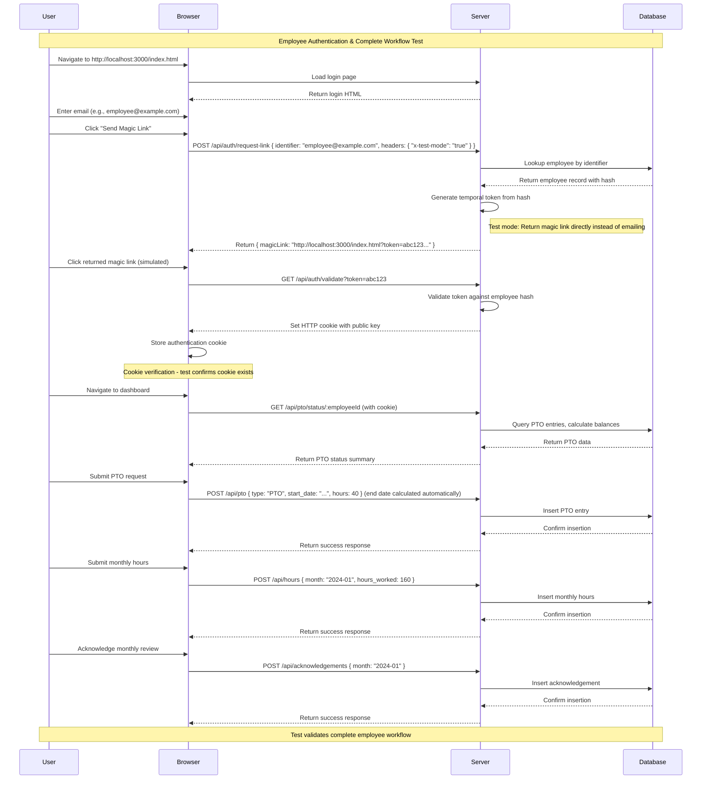

#### Key Testing Features

**Authentication Testing:**

- Magic link generation and validation
- Cookie-based session management
- Secure token handling

**Workflow Validation:**

- PTO status dashboard access
- Time off request submission
- Monthly hours reporting
- Acknowledgement system
- Data persistence and retrieval

**Testing Infrastructure:**

- **Magic Link Bypass**: For E2E testing, the `/api/auth/request-link` endpoint returns the magic link URL directly instead of sending an email. This allows automated tests to access the link programmatically.
- **Cookie Verification**: Tests confirm that authentication cookies are properly set and maintained.
- **State Management**: Each test run uses isolated database state to prevent interference.

#### Future Test Extensions

The employee authentication test serves as a foundation for comprehensive workflow testing:

1. **Admin Workflow Tests**: Parallel E2E tests covering admin panel functionality
2. **Multi-User Scenarios**: Tests with multiple employees and admins interacting
3. **Edge Case Testing**: Invalid tokens, expired sessions, permission boundaries
4. **Performance Testing**: Load testing with multiple concurrent users
5. **Cross-Browser Testing**: Validation across different browser environments

#### Implementation Notes

- Tests run against `http://localhost:3000` with the development server
- Database is seeded with test data before each test run
- Authentication bypass is clearly marked as testing-only functionality
- Production deployment will use proper email delivery for magic links
- **Test Mode**: Server detects test mode via `x-test-mode: true` header or `NODE_ENV=test`
- **Magic Link Return**: In test mode, `/api/auth/request-link` returns the magic link URL directly for automated testing
- **Test File**: `e2e/employee-workflow.spec.ts` implements the complete employee authentication and workflow test

## Monthly Review & Acknowledgement System

**Status: Partially Implemented** - Basic acknowledgement functionality exists for both employees and admins, but automated reminders are not yet implemented.

Currently provides:

- Manual submission of monthly acknowledgements via API (employee and admin), including review of hours worked and PTO usage breakdown by category (PTO, Sick, Bereavement, Jury Duty)
- Tracking of acknowledgement timestamps for both types
- Basic acknowledgement status checking
- Admin panel integration for admin acknowledgments

**Planned automated features (not yet implemented):**

- Automatic reminders at month-end
- Daily follow-up reminders for unacknowledged reviews
- Automated reminder scheduler system

### Acknowledgement Process

- Employees can manually submit acknowledgements via the API after reviewing their monthly hours worked and PTO usage breakdown by category
- Admins can acknowledge employee submissions after reviewing the same breakdown
- The system tracks acknowledgement timestamps
- **Automated reminders are planned but not yet implemented**

### Reminder Workflow

**Current state:** Manual acknowledgement only
**Planned:** Automated monthly and daily reminder system

## Similar Projects/Solutions

Here are some similar open-source projects and commercial solutions that can serve as inspiration:

1. **Time Off Management Systems**:
   - [OrangeHRM](https://www.orangehrm.com/): Open-source HR management with time off tracking
   - [Sentrifugo](https://www.sentrifugo.com/): HRMS with leave management

2. **Time Tracking Applications**:
   - [Kimai](https://www.kimai.org/): Open-source time tracking software
   - [Toggl Track](https://toggl.com/track/): Commercial time tracking with PTO features

3. **PTO-Specific Trackers**:
   - [Vacation Tracker](https://github.com/vacationtracker): Open-source vacation tracking
   - [BambooHR](https://www.bamboohr.com/): Commercial HR platform with PTO management

4. **Node.js-Based HR Tools**:
   - [Node-RED HR Dashboard](https://nodered.org/): Customizable dashboard for HR metrics
   - [Express.js PTO API](https://github.com/expressjs/express): Framework for building similar APIs

These projects demonstrate various approaches to time off tracking, from simple spreadsheets to full HR suites.

## Contributing

1. Fork the repository
2. Create a feature branch
3. Make your changes
4. Add tests if applicable
5. Submit a pull request

## License

This project is licensed under the MIT License - see the LICENSE file for details.

## Migration from Legacy Spreadsheet

This application replaces the manual Excel spreadsheet tracking (see `legacy.spreadsheet.txt`) with an automated, database-driven system. The migration process involves:

- Importing existing employee data
- Converting spreadsheet entries to database records
- Setting up individual PTO rates and carryover balances
- Training users on the new interface

**📋 Migration Reference**: For detailed information about the legacy Excel spreadsheet structure, see [`.github/skills/pto-spreadsheet-layout/SKILL.md`](.github/skills/pto-spreadsheet-layout/SKILL.md) which provides comprehensive documentation of all spreadsheet sections, data layouts, and extraction patterns.

### Migration Prerequisites

- Ensure the database schema is up to date (see db/schema.sql)
- Place the legacy spreadsheet at the project root or provide a path to the script
- Confirm the database file exists at db/dwp-hours.db (a new one will be created if missing)

### Dry-Run Mode (No File Writes)

Use dry-run to validate parsing and migration logic without modifying the database or writing backups:

```bash
pnpm run migrate -- --dry-run
```

### Running the Migration

To migrate from the default legacy Excel file:

```bash
pnpm run migrate
```

To migrate from a specific file:

```bash
pnpm run migrate -- /absolute/path/to/legacy.xlsx
```

### Backups and Rollback

By default, the migration creates a timestamped backup in db/backups before writing changes. You can disable this with --no-backup.

Rollback to a specific backup:

```bash
pnpm run migrate -- --rollback /absolute/path/to/backup
```

Rollback to the most recent backup:

```bash
pnpm run migrate -- --rollback-latest
```
