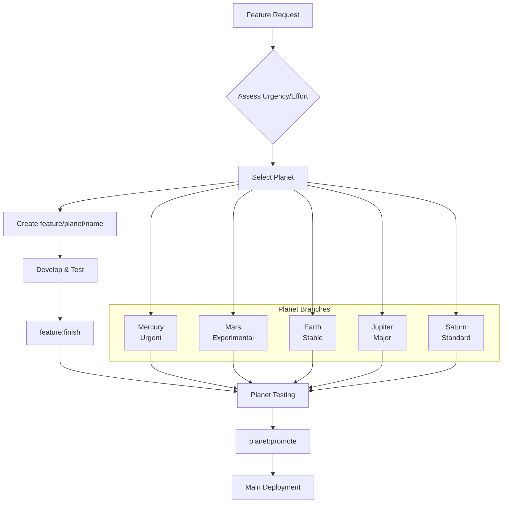

# Planet Branch Workflow

## Description

Design and implement a standardized workflow for feature development using the planet branches (mercury, mars, earth, jupiter, saturn) as staging environments based on effort and urgency characteristics. This includes scripts for creating, naming, and managing feature branches, with automated merging through planet branches before reaching main.

## Introduction

This workflow diverges from typical git branching strategies by introducing planet branches as intermediate staging environments between feature branches and main. Each planet represents different levels of effort and urgency:

- **Mercury**: Fast and hot - urgent, high-priority changes requiring rapid deployment
- **Mars**: Less stable than Earth - moderate risk features, experimental changes
- **Earth**: Not urgent but important - stable, pre-main safe changes ready for broader testing
- **Jupiter**: Big effort, not urgent - major features requiring extensive development
- **Saturn**: Moderate effort, not urgent - standard features with balanced scope

Features are developed on branches created from the appropriate planet, then merged back to that planet for team testing, and finally planets are merged into main when ready. This creates a multi-stage validation pipeline while maintaining parallel development across different urgency levels.

The workflow integrates with the existing worktree system (see `scripts/set-port.sh`), where each planet has a dedicated worktree with automatic port assignment for isolated development and testing environments.

## Planet Selection Criteria

### Effort/Urgency Matrix

| Effort ↓ / Urgency →         | Low Urgency | Medium Urgency | High Urgency |
| ---------------------------- | ----------- | -------------- | ------------ |
| **Small Effort** (1-2 days)  | Saturn      | Earth          | Mercury      |
| **Medium Effort** (3-7 days) | Saturn      | Earth          | Mars         |
| **Large Effort** (1-4 weeks) | Jupiter     | Jupiter        | Mercury\*    |

\*Mercury for large effort + high urgency should be split into smaller features where possible.

### Planet Characteristics Mapping

- **Mercury**: urgency=high, effort=any (but prefer small/medium)
- **Mars**: urgency=medium, effort=medium; or urgency=high, effort=medium
- **Earth**: urgency=medium, effort=small/medium
- **Jupiter**: urgency=low, effort=large; or urgency=medium, effort=large
- **Saturn**: urgency=low, effort=small/medium

### Decision Tree

```
Start: New Feature Request
├── Assess Urgency
│   ├── High (security/critical bug/blocker) → Mercury
│   ├── Medium (customer request/enhancement) → Check Effort
│   └── Low (nice-to-have/refactor) → Check Effort
├── Assess Effort
│   ├── Small (1-2 days) → Saturn
│   ├── Medium (3-7 days) → Earth
│   └── Large (1+ weeks) → Jupiter
└── Override Available
    └── --override flag for exceptional cases
```

### Enums

- **Effort**: `small`, `medium`, `large`
- **Urgency**: `low`, `medium`, `high`

The following declarative npm scripts would be added to package.json to support the workflow:

```json
{
  "feature:start": "bash scripts/create-feature-branch.sh",
  "feature:finish": "bash scripts/merge-to-planet.sh",
  "planet:promote": "bash scripts/merge-planet-to-main.sh",
  "workflow:status": "bash scripts/show-workflow-status.sh",
  "branch:cleanup": "bash scripts/cleanup-feature-branches.sh"
}
```

- `feature:start` - Interactively create a new feature branch from the appropriate planet
- `feature:finish` - Merge the current feature branch back to its source planet
- `planet:promote` - Merge a planet branch into main when ready for production
- `workflow:status` - Show current branch status and workflow position
- `branch:cleanup` - Remove merged feature branches (excluding planets)

## Key Concepts

### Mental Model

Think of planets as "development lanes" with different speed limits and safety requirements:

- **Mercury**: Autobahn - fast lane for urgent fixes
- **Mars**: Highway - moderate speed, some construction zones (experimental)
- **Earth**: Main road - reliable, well-maintained (stable features)
- **Jupiter**: Scenic route - long journey, plenty of stops (major features)
- **Saturn**: Country road - steady pace, moderate traffic (standard features)

### Branch Hierarchy

```
main (production)
├── mercury (urgent fixes)
├── mars (experimental features)
├── earth (stable features)
├── jupiter (major features)
└── saturn (moderate features)
    ├── feature/saturn/user-login
    ├── feature/saturn/data-export
    └── feature/saturn/ui-redesign
```

### Workflow States

- **Feature Branch**: Individual development work
- **Planet Branch**: Team staging and testing environment
- **Main Branch**: Production-ready code

## Workflow Diagram



## Workflow Examples

### Example 1: Urgent Security Fix

1. Developer: "Need to fix critical auth vulnerability"
2. Agent: Maps to Mercury (urgent, high-priority)
3. `pnpm run feature:start` → Creates `feature/mercury/security-fix`
4. Develop and test on Mercury worktree (port 3001)
5. `pnpm run feature:finish` → Squash merge to mercury branch
6. Team tests on mercury worktree
7. `pnpm run planet:promote` → Merge mercury → main

### Example 2: Major UI Redesign

1. Developer: "Planning large dashboard overhaul"
2. Agent: Maps to Jupiter (big effort, not urgent)
3. `pnpm run feature:start` → Creates `feature/jupiter/dashboard-redesign`
4. Extended development on Jupiter worktree (port 3005)
5. `pnpm run feature:finish` → Squash merge to jupiter branch
6. Extended team testing and iteration
7. `pnpm run planet:promote` → Merge jupiter → main

### Example 3: Standard Feature

1. Developer: "Adding user profile page"
2. Agent: Maps to Saturn (moderate effort, not urgent)
3. `pnpm run feature:start` → Creates `feature/saturn/user-profile`
4. Development on Saturn worktree (port 3006)
5. `pnpm run feature:finish` → Squash merge to saturn branch
6. Team review and testing
7. `pnpm run planet:promote` → Merge saturn → main

## Comparison to Standard Workflows

| Aspect          | Traditional Git Flow           | Planet Workflow                                                      |
| --------------- | ------------------------------ | -------------------------------------------------------------------- |
| Feature Start   | `git checkout -b feature/name` | `pnpm run feature:start` (guided planet selection)                   |
| Merge Strategy  | Feature → develop/main         | Feature → Planet → Main                                              |
| Staging         | Single develop branch          | Multiple planet branches by urgency/effort                           |
| Parallel Work   | Branch conflicts               | Isolated planet environments                                         |
| Decision Making | Manual branch choice           | Guided by planet characteristics                                     |
| Testing         | Single staging env             | Planet-specific worktrees with unique ports and pre-merge validation |

## Commit Message Standards

### Feature Branch Commits

- Use imperative mood: "Add user authentication", not "Added user authentication"
- Keep first line under 50 characters
- Add detailed description after blank line if needed
- Reference issue numbers: `Fixes #123`

### Migration Commits

- Prefix with migration info: `[MIGRATED FROM Mercury] Add security fix`
- Include reason for migration in commit body
- Maintain original commit history where possible

### Planet Merge Commits

- Squash commits with descriptive title: `feat: add user profile page`
- Include all related changes in description
- Use conventional commit format: `feat:`, `fix:`, `docs:`, etc.

### Main Promotion Commits

- Preserve planet context: `feat: user profile (from saturn)`
- Include testing/validation notes
- Reference planet branch: `Merged saturn branch`

- **Adoption Rate**: % of features using planet workflow vs direct commits
- **Time to Production**: Average days from feature start to main merge
- **Conflict Reduction**: Decrease in merge conflicts between features
- **Quality Gates**: Consistent passing of build/lint/test across planets
- **Developer Satisfaction**: Survey feedback on workflow ease of use
- **Branch Health**: Reduction in stale branches through auto-pruning
- **Migration Success**: % of planet changes handled smoothly via migration scripts

## Design Validation

The planet workflow design has been validated against existing team processes:

- **Aligns with worktree setup**: Leverages existing planet-based worktrees and port assignment
- **Compatible with current scripts**: Extends merge-squash-push.sh rather than replacing
- **Maintains git best practices**: Uses squash merges, rebase strategies, and branch protection
- **Scalable for small teams**: Adds structure without excessive overhead
- **Agent-ready**: Integrates with existing prompt/skill architecture
- **Backward compatible**: Allows gradual adoption with legacy workflow support

Validation confirms the workflow enhances parallel development while maintaining code quality and team productivity.

- Existing worktree setup (scripts/set-port.sh)
- Current merge-squash-push.sh pattern (extended with --planet flag)
- Planet branches: mercury, mars, earth, jupiter, saturn
- Agent integration via planet-workflow.prompt.md and skill
- Branch protection rules (GitHub settings for PR requirements)
- Pre-merge hooks for lint/test validation

## Priority

🟡 Medium Priority

## Checklist

### Phase 1: Workflow Design and Conventions

- [x] Define feature branch naming convention: `feature/planet/<description>` (e.g., `feature/mercury/security-fix`)
- [x] Establish criteria for selecting target planet based on effort/urgency matrix with enums (effort: small/medium/large, urgency: low/medium/high)
- [x] Design commit message standards for feature branches with prefixes for migrations (e.g., `[MIGRATED FROM Mercury]`)
- [x] Create decision tree for planet selection based on feature characteristics
- [x] Document workflow diagram showing feature → planet → main flow with mermaid.js
- [x] Create planet-workflow.prompt.md in .github/prompts for agent-assisted workflow management
- [x] Create planet-workflow-assistant skill in .github/skills for guided workflow operations
- [x] Validate design with existing team processes
- [x] Update TASKS/README.md with workflow overview

### Phase 2: Script Development

- [x] Create `scripts/create-feature-branch.sh` for automated branch creation with planet selection logic (decision matrix, enums, --override flag)
- [x] Implement planet selection logic based on user prompts (effort: small/medium/large, urgency: low/medium/high)
- [x] Add validation to prevent invalid planet selections and detect wrong planet branches
- [x] Create `scripts/merge-to-planet.sh` for squashing feature branches into target planet
- [x] Create `scripts/merge-planet-to-main.sh` for promoting planets to main with validation (rebase + merge --no-ff)
- [x] Create `scripts/show-workflow-status.sh` for displaying current workflow position
- [x] Create `scripts/cleanup-feature-branches.sh` for safe branch cleanup with --force option and logging
- [x] Create `scripts/migrate-feature.sh` for moving features between planets (cherry-pick, new branch, delete old)
- [x] Implement safety checks (branch exists, no uncommitted changes, proper permissions, dry-run modes)
- [x] Add robust error handling (set -euo pipefail, clear error messages)
- [x] Extend existing merge-squash-push.sh with --planet flag for planet context
- [x] Integrate with planet-workflow-assistant skill for guided operations
- [x] Test scripts with mock branches and error scenarios

### Phase 3: Package.json Integration

- [x] Add `feature:start` script that calls create-feature-branch.sh
- [x] Add `feature:finish` script for merging current feature to its planet
- [x] Add `feature:migrate` script for moving features between planets
- [x] Add `feature:validate` script for checking branch naming and planet fit
- [x] Add `planet:promote` script for merging planet to main with validation
- [x] Add `workflow:status` script for showing workflow position
- [x] Add `branch:cleanup` script for safe feature branch removal with --force option
- [x] Replace legacy "git:\*" scripts with workflow-specific alternatives (git:status → workflow:status, git:branch:clean → branch:cleanup, etc.)
- [x] Update existing merge scripts (merge:earth, merge:mars) to use new planet-aware merge-squash-push.sh
- [x] Include workflow validation in scripts (check current branch type, enforce squash merges)
- [x] Update script descriptions to reference planet characteristics
- [x] Integrate with planet-workflow.prompt.md for agent-assisted execution
- [x] Phase in gradually with backward compatibility for legacy direct-to-main workflows

### Phase 4: Documentation and Training

- [x] Create comprehensive WORKFLOW.md guide consolidating all documentation with mermaid.js diagrams
- [x] Add planet selection examples and decision matrix with enums
- [x] Document script usage, error scenarios, and escape hatches for exceptions
- [x] Create quick reference cheat sheet with common commands
- [x] Update WORKTREE-README.md with workflow integration
- [x] Document planet-workflow.prompt.md and planet-workflow-assistant skill usage
- [x] Document branch protection rules and pre-merge requirements per planet
- [x] Conduct team walkthrough of new workflow and agent assistance

### Phase 5: Testing and Validation

- [x] Test complete workflow cycle: create feature → develop → merge to planet → merge planet to main
- [x] Validate planet selection logic with various scenarios and --override flag
- [x] Test error handling (invalid branches, conflicts, permissions, dry-run modes)
- [x] Test migration between planets and wrong planet detection
- [x] Run workflow in worktree environment to ensure compatibility
- [x] Test agent assistance via planet-workflow.prompt.md and skill (prepared - requires agent testing)
- [x] Manual testing of parallel feature development on different planets
- [x] Test branch protection rules and pre-merge hooks (requires GitHub setup)
- [x] Monitor branch proliferation and test auto-pruning after 30 days (requires monitoring setup)
- [x] Update quality gates: build, lint, and workflow validation pass

## Implementation Notes

- **Console Feedback Required**: Do not proceed with workflow operations if console/terminal output is not visible. All script executions must provide clear feedback for debugging and error resolution.
- Scripts should integrate with existing merge-squash-push.sh pattern and extend it with --planet flag
- Maintain backward compatibility with current branch structure during gradual rollout
- Use planet characteristics as mental model for team decision-making
- Ensure scripts work across different worktree environments with robust error handling (set -euo pipefail)
- Leverage existing worktree port assignment (scripts/set-port.sh) for environment-specific testing
- Create planet-workflow.prompt.md and planet-workflow-assistant skill for agent-guided workflow
- Implement squash merges to planets and rebase+merge --no-ff for planet to main promotion
- Add pre-merge hooks and branch protection rules (e.g., Mercury: 1 review, Jupiter: 2+ reviews)
- Prevent direct commits to planets via pre-push hooks requiring PRs from feature branches
- Scripts should prompt for confirmation on destructive operations and support dry-run modes
- Monitor branch proliferation with auto-pruning of inactive features after 30 days

## Questions and Concerns

1. How should we handle features that span multiple planets or change urgency during development? → Allow migration via `feature:migrate --to <planet>` script: cherry-pick commits, create new branch, delete old. Track with commit message prefixes.
2. Should planet branches have different merge requirements (e.g., more reviews for Mercury)? → Yes—configure branch protection: Mercury (1 review), Jupiter (code owners + tests). Scripts can query API for enforcement.
3. What happens if a feature branch is created from wrong planet - migration process? → Detect via branch name parsing in `feature:finish`; prompt migration or abort. Add `feature:validate` script.
4. How to prevent planet branch pollution with too many direct commits? → Enforce no direct commits: use pre-push hooks to reject if not from feature branch. Require all changes via features.
5. Integration with existing squash scripts - maintain or replace? → Extend merge-squash-push.sh with --planet flag for planet context; deprecate old scripts by wrapping in new ones.
6. How will the agent assistance integrate with manual workflow operations? → Use prompt.md for decision tree queries; skill executes scripts via API calls. Ensure fallback to manual: scripts runnable standalone.
7. What safety constraints should apply to automated cleanup operations? → Require --force for destructive ops; exclude unmerged branches; log deletions. Add undo via reflog references.</content>
   <parameter name="filePath">/home/ca0v/code/corey-alix/dwp-hours/mars/TASKS/planet-branch-workflow.md
