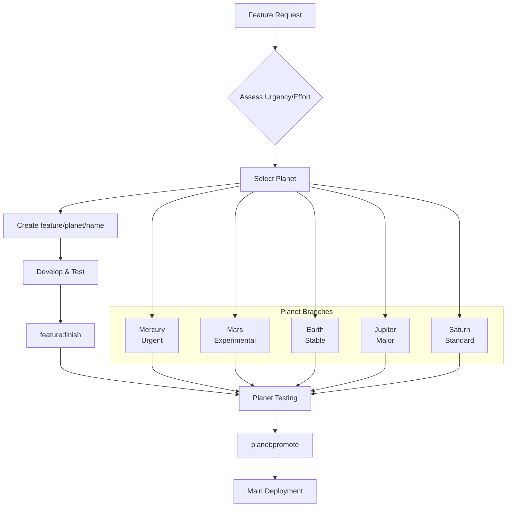

# Planet Branch Workflow Guide

## Overview

The Planet Branch Workflow is a structured approach to feature development that uses planet branches (Mercury, Mars, Earth, Jupiter, Saturn) as staging environments based on effort and urgency characteristics. This workflow enables parallel development across different priority levels while maintaining code quality and team coordination.

## Quick Start

### For Developers

```bash
# Start a new feature
pnpm run feature:start

# After development, merge to planet
pnpm run feature:finish

# Check workflow status
pnpm run workflow:status

# Clean up merged branches
pnpm run branch:cleanup
```

### For Team Leads/Release Managers

```bash
# Promote a planet to main when ready
pnpm run planet:promote

# Validate feature branch fit
pnpm run feature:validate

# Migrate feature between planets if needed
pnpm run feature:migrate
```

## Planet Selection Guide

### Effort/Urgency Matrix

| Effort ↓ / Urgency →         | Low Urgency | Medium Urgency | High Urgency |
| ---------------------------- | ----------- | -------------- | ------------ |
| **Small Effort** (1-2 days)  | Saturn      | Earth          | Mercury      |
| **Medium Effort** (3-7 days) | Saturn      | Earth          | Mars         |
| **Large Effort** (1-4 weeks) | Jupiter     | Jupiter        | Mercury\*    |

\*Mercury for large effort + high urgency should be split into smaller features where possible.

### Planet Characteristics

- **Mercury**: 🚀 Fast and hot - urgent, high-priority changes requiring rapid deployment
- **Mars**: 🔴 Less stable than Earth - moderate risk features, experimental changes
- **Earth**: 🟢 Not urgent but important - stable, pre-main safe changes ready for broader testing
- **Jupiter**: 🟠 Big effort, not urgent - major features requiring extensive development
- **Saturn**: 🟡 Moderate effort, not urgent - standard features with balanced scope

### Decision Tree

```
Start: New Feature Request
├── Assess Urgency
│   ├── High (security/critical bug/blocker) → Mercury
│   ├── Medium (customer request/enhancement) → Check Effort
│   └── Low (nice-to-have/refactor) → Check Effort
├── Assess Effort
│   ├── Small (1-2 days) → Saturn
│   ├── Medium (3-7 days) → Earth
│   └── Large (1+ weeks) → Jupiter
└── Override Available
    └── --override flag for exceptional cases
```

## Workflow Diagram



## Detailed Workflow

### 1. Feature Creation

```bash
pnpm run feature:start
```

This interactive script will:

- Ask about feature urgency (low/medium/high)
- Ask about estimated effort (small/medium/large)
- Recommend appropriate planet based on matrix
- Allow override if needed
- Create branch: `feature/{planet}/{description}`

**Example Output:**

```
What's the urgency level? (low/medium/high): medium
What's the effort level? (small/medium/large): small
Recommended planet: Earth
Create feature/earth/user-profile? (y/n): y
Switched to branch 'feature/earth/user-profile'
```

### 2. Development

Develop your feature on the created branch. Use standard git practices:

```bash
# Make changes
git add .
git commit -m "feat: add user profile functionality"

# Push for backup/collaboration
git push origin feature/earth/user-profile
```

### 3. Feature Completion

```bash
pnpm run feature:finish
```

This will:

- Squash merge your feature branch into its planet
- Delete the feature branch
- Switch to the planet branch

**Commit Message Format:** `feat: {description} (from feature/{planet}/{name})`

### 4. Planet Testing

Team testing happens on planet branches. Each planet has:

- Dedicated worktree environment
- Unique port for isolated testing
- Appropriate review requirements

### 5. Planet Promotion

```bash
# Switch to planet branch first
git checkout saturn

# Promote to main
pnpm run planet:promote
```

This performs:

- Rebase validation
- Merge --no-ff to main
- Preserves planet context in commit

## Worktree Integration

The workflow integrates with existing worktrees:

| Planet  | Worktree Path | Port | Purpose           |
| ------- | ------------- | ---- | ----------------- |
| Mercury | `../mercury`  | 3001 | Urgent fixes      |
| Mars    | `../mars`     | 3002 | Experimental      |
| Earth   | `../earth`    | 3003 | Stable features   |
| Jupiter | `../jupiter`  | 3005 | Major features    |
| Saturn  | `../saturn`   | 3006 | Standard features |

**Example:** Develop on Saturn worktree

```bash
cd ../saturn
pnpm run feature:start  # Creates feature in saturn worktree
# Develop and test on port 3006
pnpm run feature:finish  # Merges back to saturn planet
```

## Script Reference

### Feature Management

```bash
# Start new feature with guided planet selection
pnpm run feature:start

# Finish current feature (merge to planet)
pnpm run feature:finish

# Validate current branch naming and planet fit
pnpm run feature:validate

# Migrate feature between planets
pnpm run feature:migrate
```

### Planet Management

```bash
# Promote planet to main (from planet branch)
pnpm run planet:promote
```

### Workflow Utilities

```bash
# Show current workflow status and position
pnpm run workflow:status

# Clean up merged feature branches
pnpm run branch:cleanup
```

### Legacy Scripts (Gradual Migration)

```bash
# These still work but prefer workflow alternatives
pnpm run git:status        # → pnpm run workflow:status
pnpm run git:branch:clean  # → pnpm run branch:cleanup
```

## Error Scenarios & Escape Hatches

### Wrong Planet Selected

```bash
# Option 1: Migrate the feature
pnpm run feature:migrate

# Option 2: Manual migration
git checkout -b feature/correct-planet/name
git cherry-pick feature/wrong-planet/name
git branch -D feature/wrong-planet/name
```

### Feature Branch Conflicts

```bash
# Rebase on latest planet
git fetch origin
git rebase origin/saturn

# Or merge if rebase fails
git merge origin/saturn
```

### Planet Promotion Fails

```bash
# Check for uncommitted changes
git status

# Ensure on correct planet branch
git branch --show-current

# Force push if needed (rare)
pnpm run planet:promote --force
```

### Branch Cleanup Issues

```bash
# Check what would be cleaned
pnpm run branch:cleanup --dry-run

# Force cleanup if needed
pnpm run branch:cleanup --force
```

## Commit Message Standards

### Feature Branch Commits

- Use imperative mood: `"Add user authentication"`, not `"Added user authentication"`
- Keep first line under 50 characters
- Add detailed description after blank line if needed
- Reference issue numbers: `Fixes #123`

### Migration Commits

- Prefix with migration info: `[MIGRATED FROM Mercury] Add security fix`
- Include reason for migration in commit body
- Maintain original commit history where possible

### Planet Merge Commits

- Squash commits with descriptive title: `feat: add user profile page`
- Include all related changes in description
- Use conventional commit format: `feat:`, `fix:`, `docs:`, etc.

### Main Promotion Commits

- Preserve planet context: `feat: user profile (from saturn)`
- Include testing/validation notes
- Reference planet branch: `Merged saturn branch`

## Branch Protection Rules

### Recommended GitHub Branch Protection

| Planet  | Required Reviews | Require Status Checks | Restrictions |
| ------- | ---------------- | --------------------- | ------------ |
| Mercury | 1                | Lint, Build           | None         |
| Mars    | 1                | Lint, Build, Unit     | None         |
| Earth   | 2                | Lint, Build, Unit     | None         |
| Jupiter | 2+               | All Tests             | Code Owners  |
| Saturn  | 1                | Lint, Build           | None         |

### Pre-merge Requirements

- **All Planets**: Must pass `pnpm run lint && pnpm run build`
- **Mars+**: Must pass unit tests
- **Jupiter**: Must pass E2E tests and have code owner approval
- **Mercury**: Fast-tracked but still requires basic validation

## Agent Assistance

The workflow includes AI agent support for guidance:

### Planet Selection Assistant

Ask the agent: _"Help me choose the right planet for my feature"_

The agent will guide you through:

- Urgency assessment
- Effort estimation
- Planet recommendation with reasoning

### Workflow Guidance

Ask the agent: _"What's the next step in the planet workflow?"_

The agent will:

- Analyze current branch and status
- Provide contextual next steps
- Explain available commands

### Agent Integration Files

- **Prompt**: `.github/prompts/planet-workflow.prompt.md` - Comprehensive workflow guidance
- **Skill**: `.github/skills/planet-workflow-assistant/SKILL.md` - Specialized workflow operations

The agent can execute workflow commands and provide contextual help based on your current development state.

## Examples

### Example 1: Urgent Security Fix

```bash
# Developer reports urgent issue
pnpm run feature:start
# Urgency: high, Effort: small → Mercury

# Develop fix
echo "Security patch" > fix.txt
git add fix.txt
git commit -m "fix: security vulnerability in auth"

# Merge to Mercury
pnpm run feature:finish

# Team tests on Mercury worktree (port 3001)
# Then promote to production
git checkout mercury
pnpm run planet:promote
```

### Example 2: Major UI Redesign

```bash
# Planning large redesign
pnpm run feature:start
# Urgency: low, Effort: large → Jupiter

# Extended development on Jupiter worktree (port 3005)
cd ../jupiter
# Multiple commits over weeks...

# Finish feature
pnpm run feature:finish

# Extended team testing and iteration
# Code review with multiple reviewers
# E2E testing completion

# Promote when ready
git checkout jupiter
pnpm run planet:promote
```

### Example 3: Standard Feature

```bash
# Adding user profile page
pnpm run feature:start
# Urgency: low, Effort: medium → Saturn

# Development and testing
# Merge to Saturn
pnpm run feature:finish

# Team review and testing
# Promote to main
git checkout saturn
pnpm run planet:promote
```

## Migration from Legacy Workflow

### Gradual Adoption

1. **Phase 1**: Use planet workflow for new features only
2. **Phase 2**: Migrate existing feature branches to planet system
3. **Phase 3**: Deprecate direct commits to main

### Legacy Compatibility

All existing scripts still work:

- `pnpm run git:status` (shows deprecation notice)
- `pnpm run git:branch:clean` (shows deprecation notice)
- Direct merges to main still allowed (with warnings)

### Migration Commands

```bash
# Migrate existing feature to planet workflow
pnpm run feature:migrate --from legacy-branch --to saturn

# Validate planet fit for existing branches
pnpm run feature:validate --branch feature/legacy-feature
```

## Troubleshooting

### Common Issues

**"Not on a feature branch" error**

- Ensure you're on a `feature/planet/name` branch
- Use `git branch --show-current` to check

**"Planet not found" error**

- Valid planets: mercury, mars, earth, jupiter, saturn
- Check spelling and case sensitivity

**Merge conflicts during promotion**

- Rebase planet on latest main first
- Resolve conflicts manually
- Test thoroughly before promotion

**Worktree port conflicts**

- Each planet has dedicated port (3001-3006)
- Check `pnpm run worktree:port` for current assignment

### Getting Help

1. Check workflow status: `pnpm run workflow:status`
2. Validate current branch: `pnpm run feature:validate`
3. Ask the agent: _"Help with planet workflow issue"_
4. Check this guide and TASKS/planet-branch-workflow.md

## Quick Reference Cheat Sheet

### Daily Development

```
pnpm run feature:start     # New feature
pnpm run feature:finish    # Complete feature
pnpm run workflow:status   # Check status
```

### Team Operations

```
pnpm run planet:promote    # Deploy planet
pnpm run branch:cleanup    # Clean branches
pnpm run feature:validate  # Check branch
```

### Advanced Operations

```
pnpm run feature:migrate    # Move between planets
pnpm run worktree:port      # Check port assignment
```

### Planet Matrix

```
Urgent + Small → Mercury
Urgent + Large → Mercury (split if possible)
Medium + Small → Earth
Medium + Large → Jupiter
Low + Any → Saturn/Jupiter
```

---

_This workflow enhances parallel development while maintaining code quality. Start with `pnpm run feature:start` for your next feature!_ 🚀

## Team Training & Adoption

### Conducting Team Walkthroughs

1. **Demo Session**: Show complete workflow cycle (15-20 minutes)
   - Start feature with planet selection
   - Develop and commit changes
   - Finish feature to planet
   - Promote planet to main

2. **Interactive Workshop**: Hands-on practice (30-45 minutes)
   - Each team member creates a test feature
   - Practice planet selection decisions
   - Experience worktree integration

3. **Q&A Session**: Address concerns and edge cases (15 minutes)
   - Migration from legacy workflow
   - Error scenarios and recovery
   - Integration with existing processes

### Training Materials

- **WORKFLOW.md**: Complete reference guide
- **WORKTREE-README.md**: Worktree integration details
- **TASKS/planet-branch-workflow.md**: Implementation details
- **Agent Assistance**: Available via planet-workflow.prompt.md

### Adoption Timeline

- **Week 1**: Training and documentation review
- **Week 2**: Pilot with 1-2 features using new workflow
- **Week 3**: Full team adoption for new features
- **Month 2**: Migrate legacy branches and deprecate old scripts
